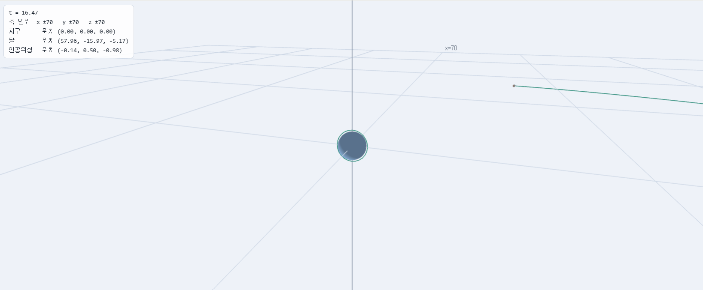
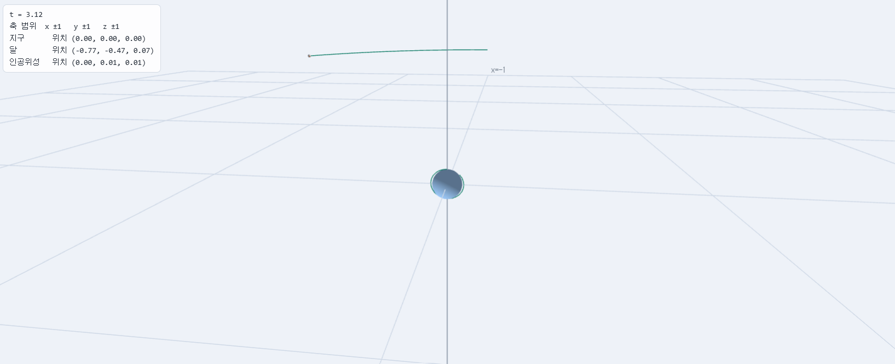
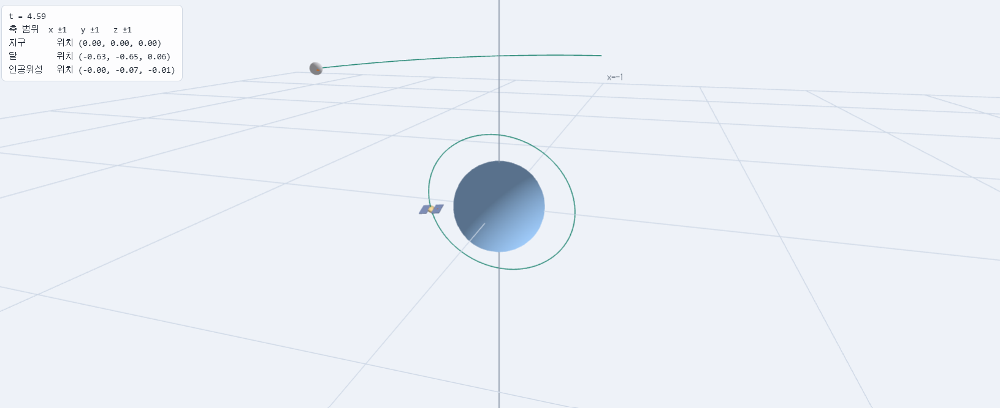

# 2주차 — 지구 · 달 · 인공위성의 변환 설계

- 이름: 홍채연
- 저장소: https://github.com/hongchaeyeon413/cg-2026-solar.git
- 실행: [Task 1](task1.html) · [Task 2](task2.html) · [Task 3](task3.html)


## 순서를 바꿔 보고 답해 보기

### 1. T를 Rz 앞으로 옮기면 달의 움직임이 어떻게 달라지는가?

기본 배치는 `Rz · T · S`(왼쪽부터 나열, 오른쪽이 먼저 적용)로, 실제 적용 순서는 S(크기) → T(이동) → Rz(공전)입니다. 이때는 크기가 정해진 달을 먼저 궤도 거리만큼 이동시키고, 그 위치를 원점(지구) 중심으로 회전시키므로 달이 지구 주위를 공전합니다.

T를 Rz보다 앞(왼쪽)으로 옮기면 `T · Rz · S`가 되어, 실제 적용 순서는 S(크기) → Rz(회전) → T(이동)가 됩니다. 이때 달은 지구를 중심으로 돌지 않고, 한 지점에 고정된 채 제자리에서만 자전합니다. 즉 공전이 사라지고 자전만 남습니다.

### 2. S(크기)를 맨 앞으로 옮기면 무엇이 달라지는가? 달라지지 않는다면 그 이유는?

기본 배치 `Rz · T · S`에서 S를 맨 앞으로 옮기면 `S · Rz · T`가 되고, 실제 적용 순서는 T(이동) → Rz(회전) → S(크기)가 됩니다.

크기(S)가 균등크기(모든 축에 같은 비율)일 경우에는 결과가 달라지지 않습니다. 균등크기 변환과 회전·이동은 서로 순서를 바꿔도 최종적으로 같은 모양과 위치가 나오기 때문입니다. 크기는 물체를 모든 방향으로 똑같은 비율로 부풀리거나 줄이기만 할 뿐 방향(회전)이나 위치(이동)에 영향을 주지 않으므로, 먼저 적용되든 나중에 적용되든 결과는 동일합니다.

다만 만약 S가 축마다 다른 비율을 적용하는 비균등크기였다면, 순서에 따라 결과가 달라졌을 것입니다. 실제로 비균등크기를 넣고 순서를 바꿔본 결과, 달이 지구 주위를 이상한 궤적으로 도는 것을 확인했습니다. 비균등크기는 특정 축 방향으로만 물체를 늘이거나 줄이는데, 이 비대칭적인 크기 변환이 회전(공전)과 순서가 바뀌면 회전축 자체가 뒤틀려서 원래 원 모양이어야 할 공전 궤도가 찌그러진 형태로 나타나기 때문으로 보입니다.

### 3. 세 행렬을 배열하는 방법은 6가지입니다. 그중 달의 공전을 올바르게 표현하는 것은 몇 가지인가?

1가지입니다. `Rz`, `T`, `S`를 배열하는 6가지 순서 중, 공전(달이 궤도를 그리며 지구 주위를 도는 것)을 올바르게 표현하려면 실제 적용 순서가 반드시 크기(S) → 이동(T) → 회전(Rz) 이어야 합니다. 크기는 이동·회전과 순서가 바뀌어도 결과가 같으므로, 사실상 중요한 것은 T와 Rz의 상대적 순서입니다. T가 Rz보다 먼저 적용되어야(카드 배치상 Rz가 T보다 왼쪽에 있어야) 이동한 위치를 중심으로 회전하여 공전이 만들어집니다. 반대로 Rz가 T보다 먼저 적용되면(카드 배치상 T가 Rz보다 왼쪽에 있으면) 제자리 자전만 일어나고 공전은 표현되지 않습니다.


## Task 1 — 실제 비율로 배치하기

### 조사한 값

| 항목 | 값 | 출처 |
| --- | --- | --- |
| 지구 반지름 | 6,371 km | 위키백과 |
| 지구 자전축 기울기 | 23.5도 | 위키백과 |
| 달 반지름 | 1,737 km | 위키백과 |
| 지구로부터 달까지 거리 | 384,400 km | 위키백과 |
| 달 궤도경사각(황도면 기준) | 5.1도 | 위키백과 |
| 대상 위성 | 아리랑 3호, 고도 697.86 km | satellitemap.space |
| 위성 궤도 반지름 | 7,064 km | satellitemap.space |
| 위성 궤도경사각 | 98.1265도 | satellitemap.space |
| 위성 크기 | 지름 2.9m × 높이 3.5m | 위키백과 |
| 위성 질량 | 980 kg | 위키백과 |

### 단위를 정한 방법

지구 반지름을 `1`로 두었습니다. 숫자가 너무 커지면(예: km 단위로 그대로 쓸 경우 지구-달 거리가 384,400이 됨) 값을 입력하고 다루기가 번거롭고, 축 범위나 배율 같은 다른 수치들도 함께 커져서 계산이 복잡해지기 때문입니다. 지구 반지름을 기준값 1로 정규화하면, 다른 모든 거리와 크기를 지구 대비 몇 배인지로 간단히 표현할 수 있어 다루기 쉬워집니다.

이 기준으로 계산한 값은 다음과 같습니다.

- 달의 궤도 거리: 384,400 / 6,371 ≈ 60.3
- 달의 크기 비율: 1,737 / 6,371 ≈ 0.27
- 아리랑 3호의 궤도 거리: 7,064 / 6,371 ≈ 1.11
- 아리랑 3호의 크기 비율: 3.5 / 6,371,000 ≈ 0.00000055

이 단위를 기준으로 축 범위는 가장 먼 천체인 달의 가장자리(60.3 + 0.27 ≈ 60.6)까지 여유 있게 보이도록 `±70`으로 설정했습니다.

### 내가 넣은 변환

**설정 JSON**

```json
{
  "range": {
    "x": "70",
    "y": "70",
    "z": "70"
  },
  "objects": [
    {
      "id": "earth",
      "name": "지구",
      "color": [0.35, 0.6, 0.95],
      "steps": [
        { "type": "Ry", "args": ["23.5"] },
        { "type": "Rx", "args": ["t*30"] },
        { "type": "S", "args": ["1", "1", "1"] },
        { "type": "T", "args": ["0", "0", "0"] }
      ]
    },
    {
      "id": "moon",
      "name": "달",
      "color": [0.78, 0.78, 0.82],
      "steps": [
        { "type": "Ry", "args": ["5.1"] },
        { "type": "Rz", "args": ["t*10"] },
        { "type": "T", "args": ["-60.34", "0", "0"] },
        { "type": "Su", "args": ["0.27"] }
      ]
    },
    {
      "id": "sat",
      "name": "인공위성",
      "color": [0.95, 0.72, 0.35],
      "steps": [
        { "type": "Ry", "args": ["98.13"] },
        { "type": "Rz", "args": ["t*100"] },
        { "type": "T", "args": ["-1.11", "0", "0"] },
        { "type": "Su", "args": ["0.00000055"] },
        { "type": "Rx", "args": ["t*100"] }
      ]
    }
  ]
}
```

---

**지구**

```json
[
  { "type": "Ry", "args": ["23.5"] },
  { "type": "Rx", "args": ["t*30"] },
  { "type": "S",  "args": ["1", "1", "1"] },
  { "type": "T",  "args": ["0", "0", "0"] }
]
```

행렬은 오른쪽부터 정점에 적용되므로, 실제 적용 순서는 T(이동) → S(크기) → Rx(자전) → Ry(기울기)입니다.

- T(0,0,0): 지구를 좌표계의 원점에 고정했습니다. 달과 위성의 궤도 거리를 지구 중심 기준으로 계산했기 때문에, 지구 자신은 원점에 있어야 합니다.
- S(1,1,1): 지구 반지름을 정규화 기준값 1로 두었으므로, 지구의 크기는 그대로 1을 사용했습니다.
- Rx(t*30): 지구의 자전을 표현했습니다. 시간(t)에 비례해 계속 회전하도록 t를 곱한 식을 사용했습니다. 회전 계수 30은 실제 관측값이 아니라, 화면에서 자전이 눈에 보이도록 임의로 정한 시각화용 값입니다.
- Ry(23.5): 지구 자전축의 기울기(23.5도)를 표현했습니다. 이 값은 위키백과에서 조사한 지구 자전축 기울기 값입니다. 자전(Rx)보다 나중(왼쪽)에 두어, 이미 자전하고 있는 지구 전체를 통째로 23.5도 기울이도록 했습니다. 순서를 반대로 하면 자전축 자체가 매 순간 흔들리는 부자연스러운 움직임이 나타나기 때문입니다.

---

**달**

```json
[
  { "type": "Ry", "args": ["5.1"] },
  { "type": "Rz", "args": ["t*10"] },
  { "type": "T",  "args": ["-60.34", "0", "0"] },
  { "type": "Su", "args": ["0.27"] }
]
```

- Su(0.27): 달의 반지름(1,737km)을 지구 반지름(6,371km) 기준으로 정규화한 값(1,737/6,371 ≈ 0.27)입니다. 실제 크기 비율을 그대로 사용했습니다.
- T(-60.34,0,0): 지구-달 평균 거리(384,400km)를 지구 반지름 기준으로 정규화한 값(384,400/6,371 ≈ 60.34)만큼 이동시켰습니다. 부호를 음수로 한 이유는, 로컬 +X 방향 화살표를 켜고 확인했을 때 양수로 두면 달의 +X축이 지구 반대쪽을 향했기 때문입니다. 음수로 바꾸자 달이 항상 지구를 향하게 되어, 실제 달의 조석고정(항상 같은 면이 지구를 향하는 현상)을 표현할 수 있었습니다.
- Rz(t*10): 지구를 중심으로 한 공전을 표현했습니다. T(이동)보다 왼쪽(나중 적용)에 두어, 이동한 위치를 원점 중심으로 회전시켜 공전 궤적을 만들었습니다. 계수 10은 시각화를 위해 임의로 정한 값입니다.
- Ry(5.1): 달의 공전궤도가 황도면에 대해 기울어진 각도(약 5.1도)를 표현했습니다. 공전(Rz)까지 모두 끝난 뒤 마지막으로 적용되어, 궤도 원 전체를 일관되게 기울입니다.

---

**인공위성 (아리랑 3호)**

```json
[
  { "type": "Ry", "args": ["98.13"] },
  { "type": "Rz", "args": ["t*100"] },
  { "type": "T",  "args": ["-1.11", "0", "0"] },
  { "type": "Su", "args": ["0.00000055"] },
  { "type": "Rx", "args": ["t*100"] }
]
```

- Rx(t*100): 위성 자체의 자전을 표현했습니다. 맨 오른쪽에 두어 위성이 아직 원점에 있을 때 자기 축으로 먼저 돌도록 했습니다. 계수 100은 시각화용 임의값입니다.
- Su(0.00000055): 위성의 실제 크기(3.5m)를 지구 반지름(6,371,000m) 기준으로 정규화한 값입니다. 실제 비율을 그대로 적용했습니다.
- T(-1.11,0,0): 아리랑 3호의 궤도 반지름(7,064km)을 지구 반지름 기준으로 정규화한 값(7,064/6,371 ≈ 1.11)만큼 이동시켰습니다. 달과 같은 이유로 음수를 사용해, 위성이 항상 지구를 향하도록 했습니다.
- Rz(t*100): 지구를 중심으로 한 공전을 표현했습니다. 계수 100은 실제 공전 주기(약 98분으로 매우 빠름)를 반영해, 달보다 훨씬 빠르게 회전하도록 크게 잡은 값입니다.
- Ry(98.13): satellitemap.space에서 조사한 아리랑 3호의 실제 궤도경사각(98.1265도)입니다. 거의 극궤도에 가까운 값으로, 공전까지 끝난 궤도 전체를 마지막으로 이 각도만큼 기울였습니다.


### 숫자가 커서 생긴 문제가 있었는가? 있었다면 무엇인가?

아리랑 3호의 실제 크기(3.5m)를 지구 반지름 기준으로 정규화하면 약 0.00000055로, 소수점 이하 자릿수가 너무 많아 화면에 표시가 거의 불가능한 크기가 되었습니다. 실제 비율로는 정확한 값이지만, 이 값을 그대로 크기(S)에 입력하면 위성이 화면에서 점 하나도 보이지 않을 정도로 작아지는 문제가 발생했습니다. 이 때문에 실제 비율과 시각화용 크기 중 어떤 것을 쓸지 따로 판단이 필요했습니다.

또한 단위를 km나 m로 그대로 썼다면 지구-달 거리(384,400km 또는 384,400,000m)처럼 훨씬 더 큰 숫자를 다뤄야 해서, 축 범위 설정과 값 입력이 더 복잡해졌을 것입니다. 지구 반지름을 1로 정규화한 것이 이런 문제를 줄이는 방법이었습니다.

### 달·위성이 지구를 향하게 만든 것은 어느 변환 단계 덕분인가?

이동(T) 변환의 부호를 조정해서 해결했습니다. 로컬 +X 방향 화살표를 켜고 확인했을 때, 이동 값을 양수(+60.34, +1.11)로 두면 물체의 +X축이 지구 반대쪽(바깥쪽)을 향했고, 이동 값을 음수(-60.34, -1.11)로 바꾸자 물체의 +X축이 지구 중심을 향하게 되었습니다. 즉 이동 변환의 부호를 반대로 조정함으로써 물체가 이동한 방향과 물체 자신이 바라보는 방향이 반대가 되도록 만들어 지구를 향하게 만들었습니다.

- 달: T = (-60.34, 0, 0)
- 아리랑 3호: T = (-1.11, 0, 0)



- Task 1 공유 링크: https://cg.catholic.ac.kr/~mgchoi/CG/demos/d02-transform-lab.html?d=eyJyYW5nZSI6eyJ4IjoiNzAiLCJ5IjoiNzAiLCJ6IjoiNzAifSwib2JqZWN0cyI6W3siaWQiOiJlYXJ0aCIsIm5hbWUiOiLsp4DqtawiLCJjb2xvciI6WzAuMzUsMC42LDAuOTVdLCJzdGVwcyI6W3sidHlwZSI6IlJ5IiwiYXJncyI6WyIyMy41Il19LHsidHlwZSI6IlJ4IiwiYXJncyI6WyJ0KjMwIl19LHsidHlwZSI6IlMiLCJhcmdzIjpbIjEiLCIxIiwiMSJdfSx7InR5cGUiOiJUIiwiYXJncyI6WyIwIiwiMCIsIjAiXX1dfSx7ImlkIjoibW9vbiIsIm5hbWUiOiLri6wiLCJjb2xvciI6WzAuNzgsMC43OCwwLjgyXSwic3RlcHMiOlt7InR5cGUiOiJSeSIsImFyZ3MiOlsiNS4xIl19LHsidHlwZSI6IlJ6IiwiYXJncyI6WyJ0KjEwIl19LHsidHlwZSI6IlQiLCJhcmdzIjpbIi02MC4zNCIsIjAiLCIwIl19LHsidHlwZSI6IlN1IiwiYXJncyI6WyIwLjI3Il19XX0seyJpZCI6InNhdCIsIm5hbWUiOiLsnbjqs7XsnITshLEiLCJjb2xvciI6WzAuOTUsMC43MiwwLjM1XSwic3RlcHMiOlt7InR5cGUiOiJSeSIsImFyZ3MiOlsiOTguMTMiXX0seyJ0eXBlIjoiUnoiLCJhcmdzIjpbInQqMTAwIl19LHsidHlwZSI6IlQiLCJhcmdzIjpbIi0xLjExIiwiMCIsIjAiXX0seyJ0eXBlIjoiU3UiLCJhcmdzIjpbIjAuMDAwMDAwNTUiXX0seyJ0eXBlIjoiUngiLCJhcmdzIjpbInQqMTAwIl19XX1dfQ%3D%3D

- [Task 1 실행하기](https://hongchaeyeon413.github.io/cg-2026-solar/week2/task1.html)


## Task 2 — NDC 범위에 맞추기

### 내가 넣은 변환

**설정 JSON**

```json
{
  "range": {
    "x": "1",
    "y": "1",
    "z": "1"
  },
  "objects": [
    {
      "id": "earth",
      "name": "지구",
      "color": [0.35, 0.6, 0.95],
      "steps": [
        { "type": "Su", "args": ["0.015"] },
        { "type": "Ry", "args": ["23.5"] },
        { "type": "Rx", "args": ["t*30"] },
        { "type": "Su", "args": ["1"] },
        { "type": "T", "args": ["0", "0", "0"] }
      ]
    },
    {
      "id": "moon",
      "name": "달",
      "color": [0.78, 0.78, 0.82],
      "steps": [
        { "type": "Su", "args": ["0.015"] },
        { "type": "Ry", "args": ["5.1"] },
        { "type": "Rz", "args": ["t*10"] },
        { "type": "T", "args": ["-60.34", "0", "0"] },
        { "type": "Su", "args": ["0.27"] }
      ]
    },
    {
      "id": "sat",
      "name": "인공위성",
      "color": [0.95, 0.72, 0.35],
      "steps": [
        { "type": "Su", "args": ["0.015"] },
        { "type": "Ry", "args": ["98.13"] },
        { "type": "Rz", "args": ["t*100"] },
        { "type": "T", "args": ["-1.11", "0", "0"] },
        { "type": "Su", "args": ["0.00000055"] },
        { "type": "Rx", "args": ["t*100"] }
      ]
    }
  ]
}
```

---

**지구**

```json
[
  { "type": "Su", "args": ["0.015"] },
  { "type": "Ry", "args": ["23.5"] },
  { "type": "Rx", "args": ["t*30"] },
  { "type": "Su", "args": ["1"] },
  { "type": "T",  "args": ["0", "0", "0"] }
]
```

Task 1의 값(Ry 23.5, Rx t*30, S 1, T 0,0,0)을 그대로 유지하고, 맨 앞에 공통 배율 Su(0.015)만 추가했습니다.

- Su(0.015): 축 범위를 ±70에서 ±1(NDC 범위)로 줄이면서 필요해진 공통 배율입니다. 지구 반지름을 1로 정규화한 좌표계에서, 원점(지구 중심)으로부터 가장 먼 지점인 달의 바깥쪽 가장자리(달의 궤도 거리 60.34 + 달의 반지름 0.27 = 60.61)를 기준으로 s = 1/60.61 ≈ 0.0165를 계산했고, 경계에서 잘리지 않도록 여유를 두어 0.015로 낮춰 정했습니다. 행렬은 오른쪽부터 적용되므로 맨 앞(왼쪽)에 둔 이 배율은 가장 나중에 적용되어, 회전·이동까지 끝난 지구를 위치까지 포함해 통째로 축소시킵니다.
- 나머지 Ry(23.5), Rx(t*30), Su(1), T(0,0,0)는 Task 1에서 정한 값과 이유를 그대로 유지했습니다. Task 2는 화면에 담기도록 배율을 추가하는 단계이지, Task 1의 물리적 배치 자체를 바꾸는 단계가 아니기 때문입니다.

---

**달**

```json
[
  { "type": "Su", "args": ["0.015"] },
  { "type": "Ry", "args": ["5.1"] },
  { "type": "Rz", "args": ["t*10"] },
  { "type": "T",  "args": ["-60.34", "0", "0"] },
  { "type": "Su", "args": ["0.27"] }
]
```

- Su(0.015): 지구와 동일한 공통 배율입니다. 세 물체 모두 같은 값을 써야 지구·달·위성 사이의 실제 상대 비율이 깨지지 않습니다. 물체마다 다른 배율을 쓰면 크기와 거리 사이의 비율이 왜곡되어, 비율을 유지한 채 화면에 담는다는 Task 2의 목적에 어긋납니다.
- Ry(5.1), Rz(t*10), T(-60.34,0,0), Su(0.27)는 Task 1의 값과 이유를 그대로 유지했습니다.

---

**인공위성 (아리랑 3호)**

```json
[
  { "type": "Su", "args": ["0.015"] },
  { "type": "Ry", "args": ["98.13"] },
  { "type": "Rz", "args": ["t*100"] },
  { "type": "T",  "args": ["-1.11", "0", "0"] },
  { "type": "Su", "args": ["0.00000055"] },
  { "type": "Rx", "args": ["t*100"] }
]
```

- Su(0.015): 지구·달과 동일한 공통 배율입니다.
- 나머지 Ry(98.13), Rz(t*100), T(-1.11,0,0), Su(0.00000055), Rx(t*100)는 Task 1의 값과 이유를 그대로 유지했습니다.
- 다만 이 배율을 적용해도 위성의 실제 크기 비율(0.00000055)이 워낙 극단적으로 작기 때문에, 화면상에서는 위성이 사실상 보이지 않는 점을 확인했습니다. 이는 실제 비율을 그대로 지키는 한 배율을 아무리 조정해도 해결되지 않는 근본적인 한계이며, 이 관찰이 Task 3에서 "실제 비율이 정보 전달에 부적합하다"고 판단한 근거가 되었습니다.

### s를 얼마로 정했고 그 값을 어떻게 계산했는가?

s = 0.015로 정했습니다.

s = 1 / (원점에서 가장 먼 지점까지의 거리)


지구 반지름을 1로 정규화한 좌표계에서, 원점(지구 중심)에서 가장 먼 지점은 달의 바깥쪽 가장자리였습니다. 달의 궤도 거리(60.34)와 달의 반지름(0.27)을 더해서 계산했습니다.

60.34 (지구-달 거리) + 0.27 (달 반지름) = 60.61
s = 1 / 60.61 ≈ 0.0165

이 값(0.0165)을 그대로 쓰면 달의 가장자리가 NDC 경계(-1~1)에 딱 걸쳐서 잘릴 위험이 있어서, 여유를 두어 s = 0.015로 낮춰 정했습니다.


### 배율 행렬을 사슬의 맨 앞에 넣은 이유는 무엇인가? 맨 뒤에 넣으면 어떻게 되는가?

행렬은 오른쪽부터 정점에 적용되기 때문에, 사슬의 맨 앞(맨 왼쪽)에 넣은 배율(Su)은 가장 나중에 적용됩니다. 즉 회전·이동·크기까지 다 끝나서 이미 제자리에 놓인 물체를, 위치까지 포함해서 통째로 축소시키는 역할을 합니다. 그래서 맨 앞에 넣으면 물체의 크기뿐 아니라 원점으로부터의 거리(위치)까지 함께 같은 비율로 줄어들어, 장면 전체가 축소된 형태로 화면 안에 들어오게 됩니다.

반대로 배율을 맨 뒤에 넣으면, 가장 먼저 적용되어 물체 자신의 크기만 줄어들고, 그 뒤에 적용되는 이동(T)은 원래 값(예: 달의 경우 60.34) 그대로 유지됩니다. 결과적으로 물체는 작아지지만 위치는 전혀 줄어들지 않아서, 여전히 NDC 범위(-1~1) 밖에 있어 화면에 나타나지 않습니다.

이 차이를 실제로 확인해보면, 맨 앞에 넣었을 때는 위치도 60.3s, 크기도 0.273s로 둘 다 배율만큼 줄어드는 반면, 맨 뒤에 넣었을 때는 위치는 60.3 그대로이고 크기만 줄어들어 달이 여전히 화면 밖에 머무릅니다.

### 세 물체에 같은 배율을 쓴 이유는 무엇인가?

지구, 달, 인공위성 세 물체 모두 동일한 s = 0.015를 사용했습니다. 물체마다 다른 배율을 쓰면 크기와 거리 사이의 실제 비율이 깨지기 때문입니다. Task 2의 목적은 크기와 거리를 임의로 조정하는 것이 아니라, Task 1에서 실제 수치(지구 반지름, 달의 궤도 거리와 반지름, 위성의 궤도 거리 등)로 만들어 둔 비율을 그대로 유지한 채 화면 안에 담기게 하는 것입니다. 그래서 같은 배율 하나를 공통으로 곱해 장면 전체를 동일한 비율로 축소시켜야, 지구·달·위성 사이의 상대적인 크기와 거리 관계가 실제 그대로 보존됩니다.

### 비율을 유지한 결과, 화면에서 지구와 인공위성은 어떻게 보이는가?

배율을 적용한 결과, 화면에는 세 물체가 모두 NDC 범위(-1~1) 안에 들어오게 되었습니다. 다만 실제 비율을 그대로 유지했기 때문에 크기 차이가 매우 극단적으로 드러납니다.

지구는 반지름이 1(정규화 기준)이고 배율 0.015가 곱해져 상대적으로 화면에서 뚜렷하게 보이는 크기를 유지합니다. 반면 인공위성은 실제 비율(약 0.00000055)을 그대로 적용할 경우 배율까지 곱해지면 사실상 점 하나조차 보이지 않을 만큼 작아집니다. 이는 실제 우주에서 지구에 비해 인공위성이 극도로 작은 것과 같은 현상으로, 비율을 정확히 지킬수록 위성은 시각적으로 거의 확인이 불가능해진다는 것을 확인할 수 있었습니다.



- Task 2 공유 링크: https://cg.catholic.ac.kr/~mgchoi/CG/demos/d02-transform-lab.html?d=eyJyYW5nZSI6eyJ4IjoiMSIsInkiOiIxIiwieiI6IjEifSwib2JqZWN0cyI6W3siaWQiOiJlYXJ0aCIsIm5hbWUiOiLsp4DqtawiLCJjb2xvciI6WzAuMzUsMC42LDAuOTVdLCJzdGVwcyI6W3sidHlwZSI6IlN1IiwiYXJncyI6WyIwLjAxNSJdfSx7InR5cGUiOiJSeSIsImFyZ3MiOlsiMjMuNSJdfSx7InR5cGUiOiJSeCIsImFyZ3MiOlsidCozMCJdfSx7InR5cGUiOiJTdSIsImFyZ3MiOlsiMSJdfSx7InR5cGUiOiJUIiwiYXJncyI6WyIwIiwiMCIsIjAiXX1dfSx7ImlkIjoibW9vbiIsIm5hbWUiOiLri6wiLCJjb2xvciI6WzAuNzgsMC43OCwwLjgyXSwic3RlcHMiOlt7InR5cGUiOiJTdSIsImFyZ3MiOlsiMC4wMTUiXX0seyJ0eXBlIjoiUnkiLCJhcmdzIjpbIjUuMSJdfSx7InR5cGUiOiJSeiIsImFyZ3MiOlsidCoxMCJdfSx7InR5cGUiOiJUIiwiYXJncyI6WyItNjAuMzQiLCIwIiwiMCJdfSx7InR5cGUiOiJTdSIsImFyZ3MiOlsiMC4yNyJdfV19LHsiaWQiOiJzYXQiLCJuYW1lIjoi7J246rO17JyE7ISxIiwiY29sb3IiOlswLjk1LDAuNzIsMC4zNV0sInN0ZXBzIjpbeyJ0eXBlIjoiU3UiLCJhcmdzIjpbIjAuMDE1Il19LHsidHlwZSI6IlJ5IiwiYXJncyI6WyI5OC4xMyJdfSx7InR5cGUiOiJSeiIsImFyZ3MiOlsidCoxMDAiXX0seyJ0eXBlIjoiVCIsImFyZ3MiOlsiLTEuMTEiLCIwIiwiMCJdfSx7InR5cGUiOiJTdSIsImFyZ3MiOlsiMC4wMDAwMDA1NSJdfSx7InR5cGUiOiJSeCIsImFyZ3MiOlsidCoxMDAiXX1dfV19

- [Task 2 실행하기](https://hongchaeyeon413.github.io/cg-2026-solar/week2/task2.html)


## Task 3 — 보는 사람을 위한 표현

### 내가 넣은 변환

**설정 JSON**

```json
{
  "range": {
    "x": "1",
    "y": "1",
    "z": "1"
  },
  "objects": [
    {
      "id": "earth",
      "name": "지구",
      "color": [0.35, 0.6, 0.95],
      "steps": [
        { "type": "Su", "args": ["0.015"] },
        { "type": "Ry", "args": ["23.5"] },
        { "type": "Rx", "args": ["t*30"] },
        { "type": "Su", "args": ["3"] },
        { "type": "T", "args": ["0", "0", "0"] }
      ]
    },
    {
      "id": "moon",
      "name": "달",
      "color": [0.78, 0.78, 0.82],
      "steps": [
        { "type": "Su", "args": ["0.015"] },
        { "type": "Ry", "args": ["5.1"] },
        { "type": "Rz", "args": ["t*10"] },
        { "type": "T", "args": ["-60.34", "0", "0"] },
        { "type": "Su", "args": ["1"] }
      ]
    },
    {
      "id": "sat",
      "name": "인공위성",
      "color": [0.95, 0.72, 0.35],
      "steps": [
        { "type": "Su", "args": ["0.015"] },
        { "type": "Ry", "args": ["98.13"] },
        { "type": "Rz", "args": ["t*100"] },
        { "type": "T", "args": ["-5", "0", "0"] },
        { "type": "Su", "args": ["0.3"] },
        { "type": "Rx", "args": ["t*100"] }
      ]
    }
  ]
}
```

---

**지구**

```json
[
  { "type": "Su", "args": ["0.015"] },
  { "type": "Ry", "args": ["23.5"] },
  { "type": "Rx", "args": ["t*30"] },
  { "type": "Su", "args": ["3"] },
  { "type": "T",  "args": ["0", "0", "0"] }
]
```

Task 2까지의 값(Su 0.015, Ry 23.5, Rx t*30, T 0,0,0)을 유지하되, 지구 자신의 크기(Su)만 1에서 3으로 키웠습니다.

- Su(3): Task 2에서는 실제 비율(1)을 그대로 지켰지만, 그 상태로는 위성이 전혀 보이지 않는 문제가 있었습니다. 이를 해결하기 위해 실제 비율을 포기하고 지구·달·위성의 상대 크기를 보기 좋게 재조정하는 '크기 과장하기' 방식을 택했고, 지구를 기준으로 3을 임의로 정했습니다.
- Su(0.015), Ry(23.5), Rx(t*30), T(0,0,0)는 이전 Task의 값과 이유를 그대로 유지했습니다.

---

**달**

```json
[
  { "type": "Su", "args": ["0.015"] },
  { "type": "Ry", "args": ["5.1"] },
  { "type": "Rz", "args": ["t*10"] },
  { "type": "T",  "args": ["-60.34", "0", "0"] },
  { "type": "Su", "args": ["1"] }
]
```

- Su(1): 달 자신의 크기를 실제 비율(0.27)이 아니라 1로 키웠습니다. 지구(3)와 비교했을 때 실제 비율(0.27)에 가깝게 맞추면서도(1/3 ≈ 0.33, 실제 비율 0.27과 크게 다르지 않음) 화면에서 뚜렷하게 보이도록 정한 값입니다.
- Su(0.015), Ry(5.1), Rz(t*10), T(-60.34,0,0)는 이전 Task의 값과 이유를 그대로 유지했습니다.

---

**인공위성 (아리랑 3호)**

```json
[
  { "type": "Su", "args": ["0.015"] },
  { "type": "Ry", "args": ["98.13"] },
  { "type": "Rz", "args": ["t*100"] },
  { "type": "T",  "args": ["-5", "0", "0"] },
  { "type": "Su", "args": ["0.3"] },
  { "type": "Rx", "args": ["t*100"] }
]
```

- Su(0.3): 위성의 실제 크기 비율(0.00000055)을 그대로 두면 아무리 확대해도 보이지 않는 근본적인 한계가 있었기 때문에, 실제 비율을 포기하고 지구·달과 함께 화면에서 뚜렷하게 구분되도록 0.3으로 임의로 키웠습니다.
- T(-5,0,0): 실제 비율(-1.11)로는 위성이 지구 표면에 거의 붙어 있어 시각적으로 구분이 어려웠기 때문에, 눈에 잘 띄도록 -5로 조정했습니다. 부호는 이전 Task와 동일하게 위성이 지구를 향하도록 음수를 유지했습니다.
- Su(0.015), Ry(98.13), Rz(t*100), Rx(t*100)는 이전 Task의 값과 이유를 그대로 유지했습니다.
- 크기(0.3)와 거리(-5) 모두 실제 비율을 깨고 임의로 정한 값이므로, 이는 실제 물리적 정확성보다 시각적 인지 가능성을 우선한 선택입니다.


### 실제 비율이 정보를 전달하기에 적합한지 판단과 그 이유

실제 비율은 정보 전달에 적합하지 않다고 판단했습니다. Task 2에서 지구 반지름을 1로 정규화하고, 달(0.27)과 아리랑 3호(약 0.00000055)의 실제 크기 비율을 그대로 적용해본 결과, 위성은 화면에서 점 하나도 확인할 수 없을 정도로 작아졌습니다. 위성의 실제 궤도 반지름(1.11)도 지구 바로 근처에 있어서, 지구·달과 함께 한 화면에 놓고 보면 위성의 존재 자체를 시각적으로 파악할 수 없었습니다. 즉 수치상으로는 정확하지만, 보는 사람에게 "여기에 위성이 있다"는 정보조차 전달하지 못하므로 실제 비율은 이 목적에는 적합하지 않습니다.


### 더 나은 표현 방법 제안 및 제작

'크기 과장하기' 방법을 제안하고 실제로 만들었습니다.

실제 비율(지구 1 : 달 0.27 : 위성 0.00000055)을 그대로 유지한 채 확대하는 방법도 검토했으나, 위성의 비율 자체가 워낙 극단적으로 작아서 전체를 동일한 배율로 키워도 위성만 여전히 보이지 않는 근본적인 한계가 있었습니다. 따라서 비율을 유지하는 대신, 세 물체의 상대적 크기를 보기 좋게 재조정하는 방식을 택했습니다.

- 지구 크기(S): 3
- 달 크기(S): 1
- 위성 크기(S): 0.3

또한 위성의 거리(T)도 실제 비율(-1.11)로는 지구 표면에 거의 붙어 있어 구분이 어려웠기 때문에, 시각적으로 잘 구분되도록 -5로 조정했습니다.

### 제안한 방법의 장점과 잃는 것

장점: 지구, 달, 위성 세 물체가 모두 화면에서 뚜렷하게 구분되어 보입니다. 각 물체의 형태와 상대적 위치 관계(어느 것이 더 안쪽/바깥쪽 궤도에 있는지)를 한눈에 파악할 수 있어, 태양계 구조를 이해하는 데는 오히려 실제 비율보다 효과적입니다.

잃는 것: 실제 크기 비율과 거리 비율이 완전히 깨집니다. 특히 위성은 실제로 지구 대비 극히 작은 물체인데, 크기를 0.3(지구의 10%)까지 키우면서 실제보다 수백만 배 과장되어, 보는 사람에게 "위성이 이렇게 크다"는 잘못된 인상을 줄 수 있습니다. 거리 비율도 실제(-1.11)에서 -5로 임의 조정했기 때문에, 위성이 지구에 실제로 얼마나 가까이 있는지에 대한 정확한 정보는 전달하지 못합니다. 즉 이 방법은 "물체들의 존재와 상대적 배치를 보여주는 것"에는 적합하지만, "정확한 물리적 크기와 거리를 전달하는 것"은 포기한 표현 방식입니다.



- Task 3 공유 링크: https://cg.catholic.ac.kr/~mgchoi/CG/demos/d02-transform-lab.html?d=eyJyYW5nZSI6eyJ4IjoiMSIsInkiOiIxIiwieiI6IjEifSwib2JqZWN0cyI6W3siaWQiOiJlYXJ0aCIsIm5hbWUiOiLsp4DqtawiLCJjb2xvciI6WzAuMzUsMC42LDAuOTVdLCJzdGVwcyI6W3sidHlwZSI6IlN1IiwiYXJncyI6WyIwLjAxNSJdfSx7InR5cGUiOiJSeSIsImFyZ3MiOlsiMjMuNSJdfSx7InR5cGUiOiJSeCIsImFyZ3MiOlsidCozMCJdfSx7InR5cGUiOiJTdSIsImFyZ3MiOlsiMyJdfSx7InR5cGUiOiJUIiwiYXJncyI6WyIwIiwiMCIsIjAiXX1dfSx7ImlkIjoibW9vbiIsIm5hbWUiOiLri6wiLCJjb2xvciI6WzAuNzgsMC43OCwwLjgyXSwic3RlcHMiOlt7InR5cGUiOiJTdSIsImFyZ3MiOlsiMC4wMTUiXX0seyJ0eXBlIjoiUnkiLCJhcmdzIjpbIjUuMSJdfSx7InR5cGUiOiJSeiIsImFyZ3MiOlsidCoxMCJdfSx7InR5cGUiOiJUIiwiYXJncyI6WyItNjAuMzQiLCIwIiwiMCJdfSx7InR5cGUiOiJTdSIsImFyZ3MiOlsiMSJdfV19LHsiaWQiOiJzYXQiLCJuYW1lIjoi7J246rO17JyE7ISxIiwiY29sb3IiOlswLjk1LDAuNzIsMC4zNV0sInN0ZXBzIjpbeyJ0eXBlIjoiU3UiLCJhcmdzIjpbIjAuMDE1Il19LHsidHlwZSI6IlJ5IiwiYXJncyI6WyI5OC4xMyJdfSx7InR5cGUiOiJSeiIsImFyZ3MiOlsidCoxMDAiXX0seyJ0eXBlIjoiVCIsImFyZ3MiOlsiLTUiLCIwIiwiMCJdfSx7InR5cGUiOiJTdSIsImFyZ3MiOlsiMC4zIl19LHsidHlwZSI6IlJ4IiwiYXJncyI6WyJ0KjEwMCJdfV19XX0%3D

- [Task 3 실행하기](https://hongchaeyeon413.github.io/cg-2026-solar/week2/task3.html)