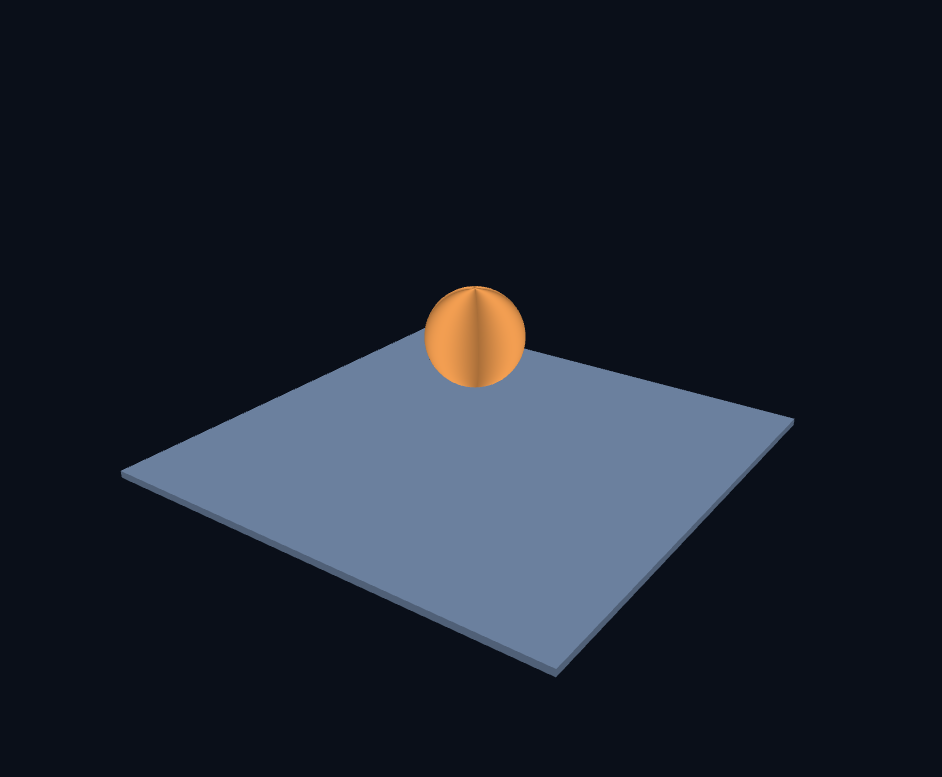
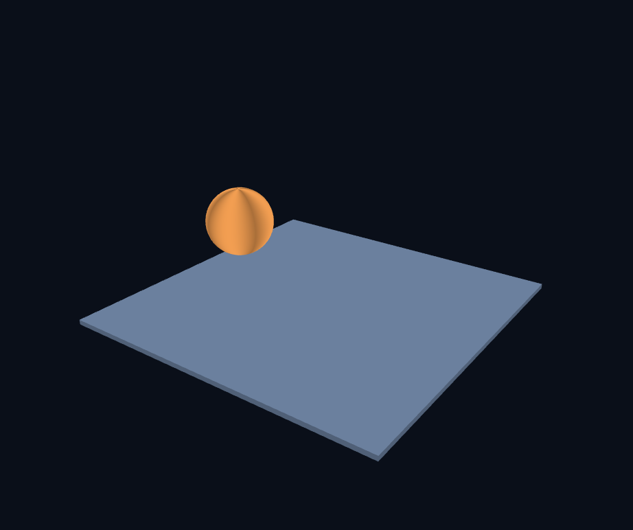
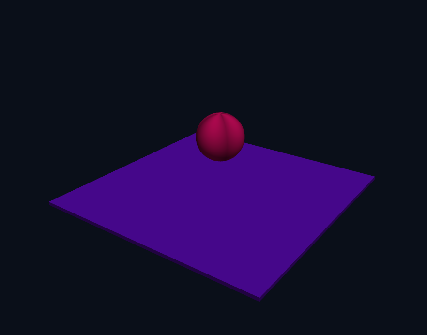
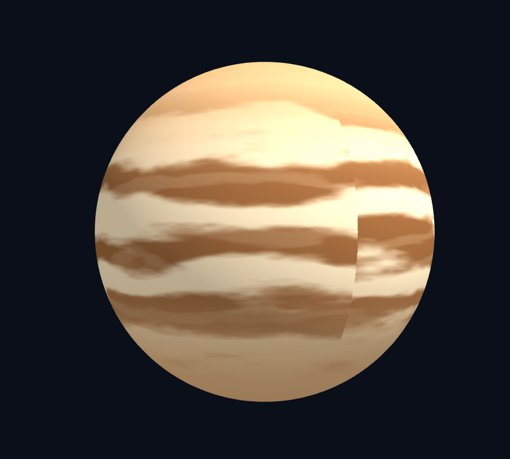
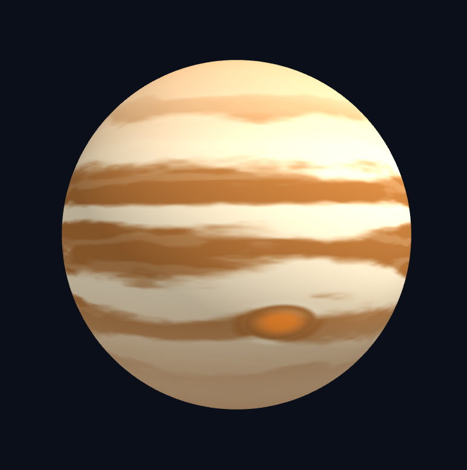
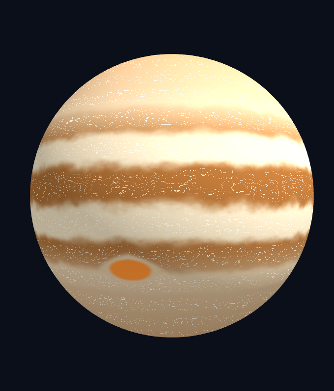
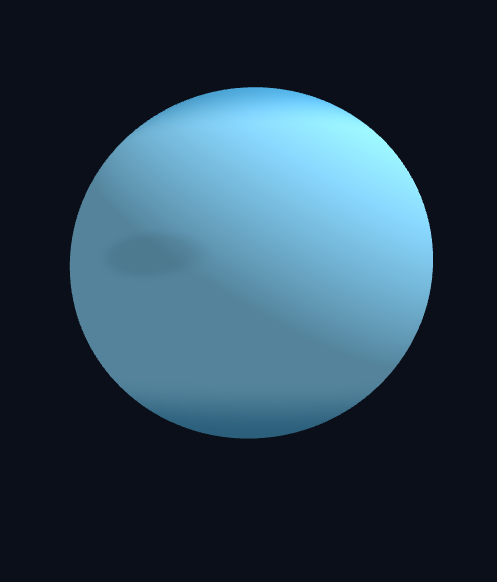
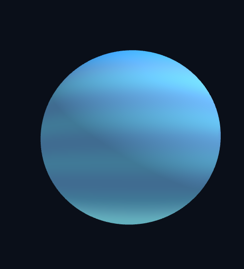
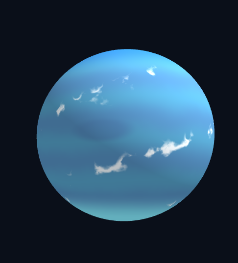

# 3주차 — 그래픽스 파이프라인과 셰이더

# 실습 1

완성 목표: 높은 곳에서 대각선으로 내려다보는 시점에서, 바닥이 깔린 3차원 공간에 공 하나가 공중에 떠서 천천히 도는 장면

## 6단계 — 변환 순서 비교: 자전 vs 공전

행렬의 **오른쪽부터 적용**된다는 규칙(2주차)을 직접 확인합니다.

### 자전 (기본)

```javascript
const model = M4.multiply(M4.translate(0, 1.9, 0), M4.rotateY(time * 0.8));
```

**적용 순서** (오른쪽부터):
1. **rotateY** (오른쪽): 공을 원점에서 y축으로 회전
2. **translate(0, 1.9, 0)** (왼쪽): 회전한 공을 위로 옮김

**결과**: 공이 y=1.9 자리에 고정되고 **제자리에서 도는 자전** (rotation around own center)

**표면 확인**: 경도별 밝기 차이 때문에 공이 도는 것을 확인할 수 있습니다.



### 공전 (순서 변경)

```javascript
const model = M4.multiply(M4.rotateY(time * 0.8), M4.translate(0, 2.0, 1.9));
```

**적용 순서** (오른쪽부터):
1. **translate(0, 2.0, 1.9)** (오른쪽): 공을 (0, 2.0, 1.9) 위치로 이동
2. **rotateY** (왼쪽): 이동한 공을 원점(y축) 중심으로 회전

**결과**: 공이 **y축 둘레를 큰 원으로 도는 공전** (orbit around center axis)

**주의**: 이동에 **x 성분(2.0)**이 있어야 공전이 눈에 띄게 보입니다. y 방향만 이동하면 y축으로 회전해도 위치가 바뀌지 않아 자전처럼 보입니다.



### 왜 순서가 중요한가?

2주차의 핵심 원리: **행렬은 오른쪽부터 적용된다**.

- **회전 → 이동**: 먼저 회전하고 나서 이동하므로, 로컬 좌표축(물체 자신의 중심)을 중심으로 회전. 이동된 위치에서 제자리 회전 = **자전**
- **이동 → 회전**: 먼저 이동하고 나서 회전하므로, 월드 좌표축(세계 원점)을 중심으로 회전. 원점에서 거리를 두고 회전 = **공전**


---

## 8단계 — 프래그먼트 셰이더 예제 실험

### uTime을 사용한 시간 기반 색상 변화

시간에 따라 색이 변하는 효과를 만들었습니다. 이 예제로 `uTime` 값이 실제로 셰이더에 전달되고 있음을 확인합니다.

**셰이더 코드**

```glsl
void main() {
  vec3 N = normalize(vNormal);
  vec3 L = normalize(vec3(0.45, 0.8, 0.35));
  
  float diff = max(dot(N, L), 0.0);
  
  // 시간에 따라 색상이 변함
  vec3 timeColor = vec3(
    sin(uTime * 2.0) * 0.5 + 0.5,
    cos(uTime * 2.0) * 0.5 + 0.5,
    1.0
  );
  
  fragColor = vec4(vColor * timeColor * (0.3 + 0.7 * diff), 1.0);
}
```

**동작 원리**

- `sin(uTime * 2.0)` : −1~1 범위로 진동 → `* 0.5 + 0.5`로 0~1로 변환 → 빨강 채널
- `cos(uTime * 2.0)` : `sin`보다 π/2만큼 앞당겨진 진동 → 초록 채널
- `1.0` : 파랑 채널은 항상 최대

**화면 결과**



**관찰**

공의 색이 계속 변하면서도 조명 효과(밝고 어두운 부분)는 유지됩니다. 색이 부드럽게 순환합니다. 

---

## 코드의 여섯 구역

### 1구역: 메시 데이터
```javascript
function makeBox(...) { ... }
function makeSphere(...) { ... }
```
**역할**: 정점 위치, 법선, 색, 인덱스를 계산하는 함수들입니다. CPU에서 실행되며, 화면에 그릴 형태의 배열을 반환합니다.

**예시**: `makeSphere(0.8, 64, 128, ...)`는 반지름 0.8, 정점 8,385개의 공을 만듭니다.

### 2구역: 버텍스 셰이더
```glsl
const VS_SOURCE = `#version 300 es
...
void main() { 
  vColor  = aColor;
  vNormal = mat3(uModel) * aNormal;
  gl_Position = uViewProj * uModel * vec4(aPos, 1.0);
}
`;
```

**역할**: GPU에서 각 정점마다 한 번씩 실행됩니다. 정점의 3D 좌표를 화면 2D 좌표(gl_Position)로 변환하고, 보간할 값(색, 법선)을 다음 단계로 넘깁니다.

**핵심**: `mat3(uModel) * aNormal`은 법선에 회전만 적용하고 이동은 버립니다.

### 3구역: 프래그먼트 셰이더
```glsl
const FS_SOURCE = `#version 300 es
...
void main() {
  vec3 N = normalize(vNormal);
  vec3 L = normalize(vec3(0.45, 0.8, 0.35));
  float diff = max(dot(N, L), 0.0);
  fragColor = vec4(vColor * (0.3 + 0.7 * diff), 1.0);
}
`;
```

**역할**: GPU에서 각 픽셀마다 한 번씩 실행됩니다. 내적을 이용해 빛의 밝기를 계산하고, 픽셀의 최종 색(fragColor)을 결정합니다.

**핵심**: 조명 계산은 여기서 일어납니다. 법선과 광원 방향의 내적이 곧 밝기입니다.

### 4구역: WebGL 준비
```javascript
const program = createProgram(VS_SOURCE, FS_SOURCE);
const uTimeLoc = gl.getUniformLocation(program, 'uTime');
const uModelLoc = gl.getUniformLocation(program, 'uModel');
const uViewProjLoc = gl.getUniformLocation(program, 'uViewProj');

const M4 = { 
  identity, translate, scale, rotateX, rotateY, multiply 
};
```

**역할**: 
- 셰이더 코드를 컴파일하고 프로그램으로 링크합니다.
- 셰이더 내 uniform 변수의 위치를 미리 찾아두어 실행 중 빠르게 접근할 수 있게 합니다.
- 행렬 계산 도구들을 정의합니다.

**왜 필요**: Uniform 위치를 매 프레임마다 검색하는 것은 비효율적이므로, 한 번만 찾아 변수에 저장합니다.

### 5구역: 버퍼 만들기
```javascript
function createMesh(mesh) { 
  // VAO, VBO 생성
  // positions, normals, colors를 GPU 메모리로 복사
}

const ball  = createMesh(makeSphere(...));
const floor = createMesh(makeBox(...));
```

**역할**: CPU의 배열을 GPU 메모리(VBO: Vertex Buffer Object)로 복사하고, VAO(Vertex Array Object)에 저장합니다.

**결과**: `ball.vao`, `floor.vao`를 나중에 그릴 때 사용합니다.

### 6구역: 그리기 루프
```javascript
function render() {
  // 매 프레임마다 호출 (초당 60회)
  
  // 시간 계산
  const time = (performance.now() - startTime) / 1000;
  
  // 카메라 행렬 구성 (①~⑥)
  let camera = M4.identity();
  camera = M4.multiply(M4.translate(0, -1.1, 0), camera);
  // ... (②~⑥ 생략)
  const viewProj = camera;
  
  // 셰이더 프로그램 활성화
  gl.useProgram(program);
  gl.uniform1f(uTimeLoc, time);           // 시간을 전달
  gl.uniformMatrix4fv(uViewProjLoc, false, viewProj);
  
  // 바닥 그리기
  gl.uniformMatrix4fv(uModelLoc, false, M4.translate(0, -0.06, 0));
  gl.bindVertexArray(floor.vao);
  gl.drawElements(gl.TRIANGLES, floor.count, gl.UNSIGNED_SHORT, 0);
  
  // 공 그리기 (자전)
  const model = M4.multiply(M4.translate(0, 1.9, 0), M4.rotateY(time * 0.8));
  gl.uniformMatrix4fv(uModelLoc, false, model);
  gl.bindVertexArray(ball.vao);
  gl.drawElements(gl.TRIANGLES, ball.count, gl.UNSIGNED_SHORT, 0);
  
  // 다음 프레임 예약
  requestAnimationFrame(render);
}
```

**역할**: 초당 60회 반복 실행되며, 매 프레임마다:
1. 시간을 계산합니다
2. 시간에 따라 변하는 행렬을 계산합니다
3. Uniform을 GPU로 보냅니다
4. 바닥, 공을 차례로 그립니다

**흐름**: 6구역 → 2구역(버텍스 셰이더) → 3구역(프래그먼트 셰이더) → 화면에 표시


# 실습2


## 실습 2 행성: 가스 행성 (Gas Giant)

### 의도

## 1. 의도 — 무엇을 만들고 싶었는가

실제 **목성(Jupiter)** 과 **해왕성(Neptune)** 두 가스 행성을 만들고 싶었습니다.

| 행성 | 종류 | 의도 | 차별점 |
| --- | --- | --- | --- |
| 목성 | 가스 거인 | 강한 대기 흐름과 대적점을 가진 거대 행성의 위엄 표현 | 적도와 극지방의 띠 굵기 변화, 띠 안쪽의 가늘고 구불거리는 흰색 실선 결, 갈색 테두리와 주황색 중심을 가진 대적점 |
| 해왕성 | 얼음 거인 | 차갑고 깊은 푸른 대기, 소용돌이치는 구름, 잔잔하지만 선명한 대흑점 표현 | 위도와 경도를 함께 써서 특정 띠에 치우치지 않고 섬유처럼 퍼지는 구름층, 남반구와 북극의 색 그라데이션 차이 |


---

## 2. 방법 — 어떻게 만들었는가

두 행성 모두 하나의 프래그먼트 셰이더(`FS_SOURCE`)에서 그리고, `uPlanetType` 값(0 = 목성, 1 = 해왕성)으로 구분했습니다. 무늬는 모두 표면 방향 벡터 `S = normalize(vSurf)` 로 계산했습니다. `vSurf` 는 회전시키기 전의 로컬 법선이라서, 무늬가 행성 표면에 붙은 채 함께 자전합니다. 무늬를 한 겹씩 쌓아 올리는 방식으로 만들었고, 각 단계는 앞 단계의 `color` 위에 `mix()` 로 덧칠했습니다.

### 2-1. 목성 — 띠 → 대적점 → 흰색 실선 순서

#### ① 구불거리는 띠

```glsl
float latitude = S.y;
float flow = fbm(S * vec3(8.0, 11.0, 8.0) + vec3(uTime * 0.20, uTime * 0.12, 0.0));
float bandFrequency = 13.0 + 8.0 * abs(latitude);
float bandPhase = latitude * bandFrequency;
float warpedBandPhase = bandPhase + flow * 1.5;
float bandWave = sin(warpedBandPhase);
float horizontalBands = 0.5 + 0.5 * bandWave;
float stripe = smoothstep(0.20, 0.80, horizontalBands);

float centerMask = smoothstep(0.18, 0.82, 1.0 - abs(latitude));
float brownLatitudeMask = 1.0 - smoothstep(0.25, 0.68, abs(latitude));
vec3 centerColor = mix(mutedCream, mutedBrown, stripe * brownLatitudeMask);

vec3 color = mix(beigeTopBottom, centerColor, centerMask);
color = mix(color, darkerBeige, smoothstep(0.75, 1.0, abs(latitude)) * 0.35);
```

- 위도 대신 `S.y` 를 써서 북극은 `1`, 적도는 `0`, 남극은 `-1` 이 되게 했습니다.
- `bandFrequency = 13.0 + 8.0 * abs(latitude)` 로 적도에서는 주파수를 낮게, 극지방에서는 높게 잡았습니다. 그래서 적도의 띠는 넓고 극지방의 띠는 촘촘해집니다.
- `flow` (3D fBm 잡음)를 `bandPhase` 에 더해 사인파의 위상을 흔들었습니다. 이 덕분에 직선이던 띠 경계가 구불거리고, `uTime` 때문에 천천히 움직입니다.
- `smoothstep(0.20, 0.80, ...)` 로 밝은 띠와 갈색 띠의 경계를 부드럽게 나눴습니다.
- `brownLatitudeMask` 는 갈색 띠가 적도 근처에만 나타나게 하고, `centerMask` 와 `darkerBeige` 는 극지방으로 갈수록 베이지 톤으로 물들게 합니다.



#### ② 대적점

```glsl
vec3 stormCenter = normalize(vec3(0.35, -0.45, 0.90));
vec3 stormHorizontal = normalize(vec3(stormCenter.z, 0.0, -stormCenter.x));
vec3 stormVertical = normalize(cross(stormCenter, stormHorizontal));
vec3 stormDelta = S - stormCenter;
float stormEastWest = dot(stormDelta, stormHorizontal) * 0.55;
float stormNorthSouth = dot(stormDelta, stormVertical);
float stormRadial = dot(stormDelta, stormCenter);

float stormOvalDistance = length(vec3(stormEastWest, stormNorthSouth, stormRadial));
float stormDiamondPower = 1.35;
float stormDiamondDistance = pow(pow(abs(stormEastWest), stormDiamondPower) + pow(abs(stormNorthSouth), stormDiamondPower) + pow(abs(stormRadial) * 0.25, stormDiamondPower), 1.0 / stormDiamondPower);

float stormCore = 1.0 - smoothstep(0.058, 0.078, stormOvalDistance);
float stormBorder = smoothstep(0.058, 0.078, stormDiamondDistance) * (1.0 - smoothstep(0.088, 0.120, stormDiamondDistance));

color = mix(color, stormBorderColor, stormBorder);
color = mix(color, stormColor, stormCore * 0.95);
```

- `stormCenter` 는 남반구 정면을 향하는 방향으로 잡았습니다. 여기서 `cross` 로 동서, 남북 방향의 두 접선 축을 만들어 폭풍 중심에서 본 좌표계를 세웠습니다.
- 동서 성분에 `0.55` 를 곱해서 거리를 줄였습니다. 같은 임계값 안에 더 넓은 영역이 들어오므로 폭풍이 가로로 긴 모양이 됩니다.
- 주황색 중심(`stormCore`)은 일반 유클리드 거리 `length()` 로 계산해 부드러운 타원으로 만들었습니다.
- 갈색 테두리(`stormBorder`)는 Lp 노름(`p = 1.35`)으로 계산해서 모서리가 살짝 각진 마름모에 가까운 윤곽을 만들었습니다. `p = 2` 이면 원이고 `p = 1` 이면 마름모라서, 그 중간 값을 쓴 것입니다.
- 코어와 테두리를 서로 다른 거리 함수로 만들었기 때문에 "타원형 중심 + 마름모형 테두리"의 이중 구조가 됩니다.



#### ③ 구불거리는 흰색 실선

```glsl
float bandInterior = smoothstep(0.35, 0.78, abs(bandWave));
float whiteWarp = fbm(S * vec3(5.0, 17.0, 5.0) + vec3(-uTime * 0.11, uTime * 0.08, uTime * 0.13));
float whiteThreadPhase = bandPhase * 8.0 + (flow - 0.5) * 18.0 + (whiteWarp - 0.5) * 22.0;
float whiteThreadWave = abs(sin(whiteThreadPhase));
float thinWhiteStripe = smoothstep(0.992, 0.999, whiteThreadWave) * bandInterior;
color = mix(color, vec3(0.99, 0.98, 0.93), thinWhiteStripe * 0.85);
```

- 이 단계는 ①에서 만든 `bandPhase`, `bandWave`, `flow` 를 다시 사용하기 때문에 띠를 먼저 만든 뒤에 만들었습니다.
- `bandPhase * 8.0` 으로 띠보다 8배 촘촘한 사인파를 만들고, `flow` 와 새 잡음 `whiteWarp` 를 큰 계수(`18.0`, `22.0`)로 더해 위상을 크게 흔들었습니다. 그래서 선이 심하게 구불거립니다.
- `abs(sin(...))` 의 꼭대기만 `smoothstep(0.992, 0.999, ...)` 로 잘라내면 아주 가는 선만 남습니다.
- `bandInterior` 를 곱해 띠의 안쪽에서만 선이 보이게 했습니다.
- 코드에서 이 단계를 대적점 계산보다 앞에 둬서, 대적점이 흰색 실선 위에 덮이도록 했습니다.



### 2-2. 해왕성 — 극지방 → 대흑점 → 줄무늬 → 구름 순서

#### ① 극지방

```glsl
float lat = normalize(vNormal).y;
color = vec3(0.35, 0.65, 0.80);

float polarZone = smoothstep(0.65, 0.95, abs(lat));
vec3 southPolarColor = vec3(0.50, 0.88, 0.95);
vec3 northPolarColor = vec3(0.20, 0.50, 0.75);
vec3 polarColor = mix(southPolarColor, northPolarColor, smoothstep(-0.02, 0.02, lat));
color = mix(color, polarColor, polarZone);
```

- 옅은 청록색 바탕색을 먼저 깔고, `abs(lat)` 가 `0.65 ~ 0.95` 인 구간을 `smoothstep` 으로 넓게 감싸 극지방 마스크(`polarZone`)를 만들었습니다.
- `lat` 의 부호(`smoothstep(-0.02, 0.02, lat)`)로 남극은 밝은 에메랄드 하늘색, 북극은 더 어두운 푸른색이 되도록 나눴습니다.


#### ② 대흑점

```glsl
vec3 neptuneSpotCenter = vec3(0.0, 0.0, 1.0);
vec3 neptuneSpotEast = normalize(vec3(neptuneSpotCenter.z, 0.0, -neptuneSpotCenter.x));
vec3 neptuneSpotNorth = normalize(cross(neptuneSpotCenter, neptuneSpotEast));
vec3 neptuneSpotDelta = S - neptuneSpotCenter;
float neptuneSpotX = dot(neptuneSpotDelta, neptuneSpotEast) * 0.38;
float neptuneSpotY = dot(neptuneSpotDelta, neptuneSpotNorth);
float neptuneSpotDistance = length(vec2(neptuneSpotX, neptuneSpotY));
float neptuneSpotMask = 1.0 - smoothstep(0.075, 0.14, neptuneSpotDistance);
color = mix(color, vec3(0.26, 0.43, 0.62), neptuneSpotMask * 0.72);
```

- 목성의 폭풍과 같은 방법(접선 축 만들기 → 동서 거리 압축 → 거리 마스크)을 쓰되, 훨씬 단순하게 `length(vec2(...))` 하나만 사용했습니다.
- 동서 거리에 `0.38` 을 곱해 가로로 긴 타원을 만들었고, 바탕색과 같은 계열에서 명도만 낮춰 잔잔하면서도 선명한 점이 되게 했습니다.



#### ③ 줄무늬(바람 띠)

```glsl
float swirl = fbm(S * 3.0 + vec3(0.0, 0.0, uTime * 0.08)) - 0.5;
float warpedLat = lat + swirl * 0.12;
float windWave = 0.5 + 0.5 * sin(warpedLat * 15.0 + uTime * 0.8);
vec3 windBandColor = mix(vec3(0.31, 0.59, 0.74), vec3(0.31, 0.50, 0.70), windWave);
color = mix(color, windBandColor, 0.72);
```

- 위도 `lat` 에 fBm 잡음 `swirl` 을 조금(`0.12`) 더해 가로 줄무늬를 살짝 구불거리게 했습니다.
- `sin(... + uTime * 0.8)` 로 줄무늬가 위도 방향으로 천천히 흐르게 했고, 두 가지 푸른색을 `windWave` 로 섞어 은은한 바람 띠를 만들었습니다.
- 목성과 달리 대비를 약하게(`0.72` 로 혼합) 해서 차분한 얼음 행성 느낌을 냈습니다.



#### ④ 구름

```glsl
float cloudFlow = fbm(S * 4.0 + vec3(uTime * 0.035, -uTime * 0.05, uTime * 0.025));
float cloudFiber = abs(sin(S.y * 4.0 + atan(S.z, S.x) * 1.2 + (cloudFlow - 0.5) * 2.5));
float cloudFiberMask = 1.0 - smoothstep(0.04, 0.35, cloudFiber);
float cloudSparseMask = smoothstep(0.55, 0.62, cloudFlow);
float cloudMask = cloudFiberMask * cloudSparseMask;
color = mix(color, vec3(1.0, 1.0, 1.0), cloudMask * 0.9);
```

- 위도(`S.y`)와 경도(`atan(S.z, S.x)`)를 함께 넣은 사인파로, 가로 띠가 아니라 비스듬히 흐르는 섬유 모양(`cloudFiberMask`)을 만들었습니다.
- 저주파 fBm 을 높은 임계값(`0.55 ~ 0.62`)으로 잘라 `cloudSparseMask` 를 만들고, 두 마스크를 곱해서 일부 구역에만 큰 구름이 생기게 했습니다.
- 구름을 가장 마지막에 덮어서 극지방, 대흑점, 줄무늬 위로 흰 구름이 지나가는 것처럼 보이게 했습니다.



### 2-3. 공통 처리 (조명과 자전)

```glsl
color *= 0.20 + 0.80 * diff;
```

- 빛 방향 `L` 과 법선 `N` 의 내적 `diff` 로 확산광을 계산하고, 밤 쪽이 완전히 검게 되지 않도록 주변광 `0.20` 을 더해 낮과 밤의 경계를 표현했습니다.
- `N` 은 `mat3(uModel) * aNormal` 로 변환한 세계 기준 법선이고 `S` 는 회전 전의 로컬 법선입니다. 그래서 무늬는 행성과 함께 자전하는데 빛은 고정된 방향에서 오게 됩니다.
- 자바스크립트 쪽에서는 같은 구 메시를 두 번 그렸습니다. 목성은 축을 기울이고(`rotateX(0.05462)`) `0.8` 속도로 자전시켰고, 해왕성은 `0.62` 배로 줄여 오른쪽에 두고 `0.55` 속도로 자전시켰습니다.

### 2-4. 시행착오 및 해결 과정 (실패한 시도)

#### 1. 목성 띠 내부 결 표현의 인공성 (패턴이 단순 반복되는 문제)

**문제 상황**

처음 목성의 위도 띠 내부에 가늘고 촘촘한 세부 결을 만들 때 `sin(bandPhase * 8.0)` 을 단순 적용했습니다. 그러자 띠 전체에 자로 잰 듯한 규칙적인 고주파 줄무늬만 생겨서, 프린트된 텍스처처럼 보였습니다.

**실패 원인**

주파수(배율)만 높이는 선형적인 계산으로는 자연스러운 대기의 불규칙성과 유체적인 일렁임을 표현하지 못했습니다.

**해결 방법**

공간 좌표 `S` 에 서로 다른 스케일과 시간 변위(`uTime`)를 적용한 3D fBm 잡음장 두 개(`flow`, `whiteWarp`)를 위상 `whiteThreadPhase` 에 함께 더해 강한 비선형 변위를 주었습니다. 이후 `abs(sin(...))` 의 꼭대기 구간만 `smoothstep(0.992, 0.999, ...)` 라는 매우 좁은 임계값으로 잘라냈습니다. 그 결과 띠 안에서 대기가 소용돌이치며 실처럼 얇게 일렁이는 자연스러운 결을 만들 수 있었습니다.

#### 2. 목성 대적점 테두리의 부자연스러운 경계 (단순 타원형의 한계)

**문제 상황**

대적점을 유클리드 거리(`length()`) 기반의 타원형으로만 만들었더니, 폭풍의 가장자리가 단조롭고 주변 대기 띠와 뚜렷하게 구분되지 않은 채 뭉개졌습니다.

**실패 원인**

거리 공식 하나로는 대적점 특유의 "중심부 타원 코어"와 "바깥쪽으로 약간 각지게 퍼지는 테두리"라는 이중 구조를 한 번에 표현하기 어려웠습니다.

**해결 방법**

일반 유클리드 거리(`p = 2.0`)와 Lp 노름(`p = 1.35`)을 함께 사용했습니다. `p = 1.35` 로 모서리가 살짝 부드러운 마름모 모양의 바깥 테두리 마스크(`stormBorder`)를 따로 만들고, 안쪽은 타원형 주황색 코어(`stormCore`)로 채웠습니다. 두 마스크가 서로 맞물리면서 입체감 있는 이중 구조의 폭풍이 완성되었습니다.

#### 3. 해왕성 구름층의 격자감과 띠 뭉침 현상

**문제 상황**

해왕성의 구름을 일반적인 2D/3D 잡음만으로 만들었더니, 구름이 특정 가로 줄무늬 띠 안에 갇히거나 픽셀 격자 모양으로 어색하게 뭉쳤습니다.

**실패 원인**

구름 위치를 정하는 위상식에 위도(`y`) 성분만 과하게 반영되어, 비스듬하게 흐르는 기류를 표현하지 못했습니다.

**해결 방법**

위도(`S.y`)에 더해 `atan(S.z, S.x)` 로 경도 성분까지 결합해서, 사선으로 일렁이는 섬유 모양의 기류(`cloudFiber`)를 만들었습니다. 여기에 큰 3D fBm 잡음을 마스크(`cloudSparseMask`)로 한 번 더 적용해서, 일부 구역에서만 구름 덩어리가 드물게 피어오르도록 했습니다.