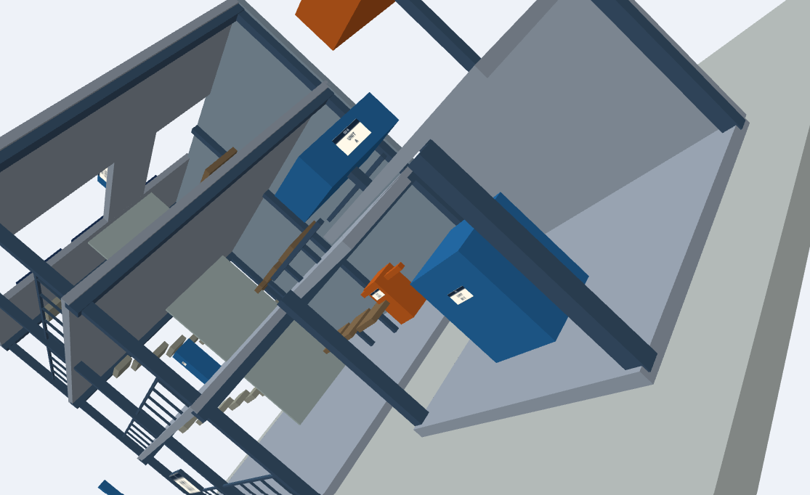
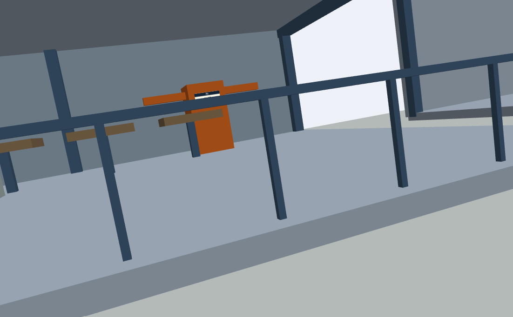
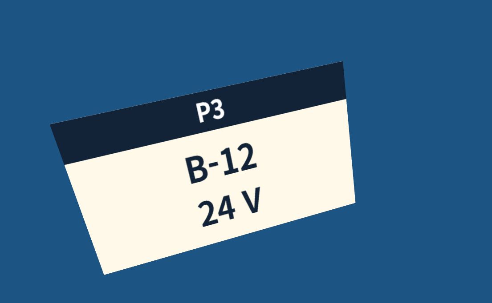
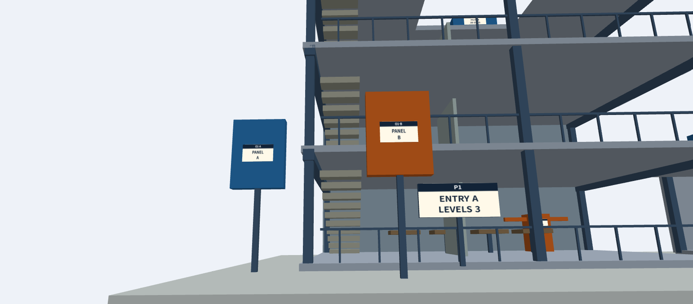
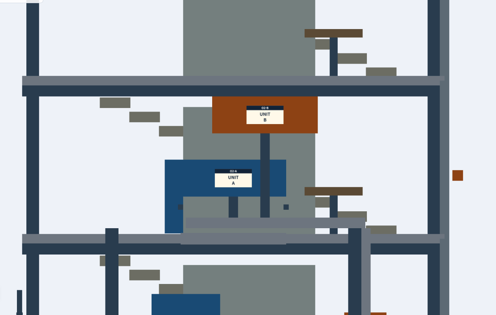
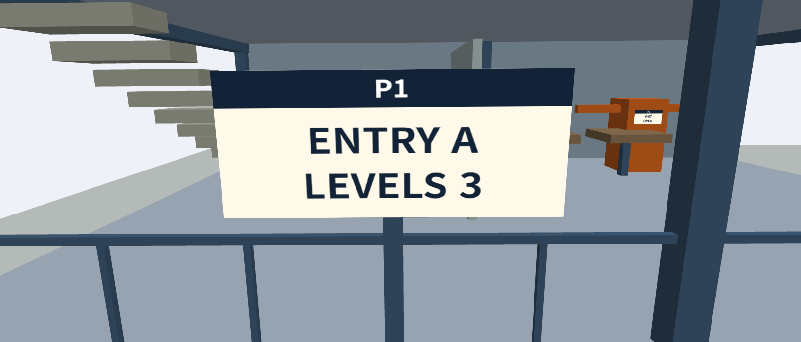
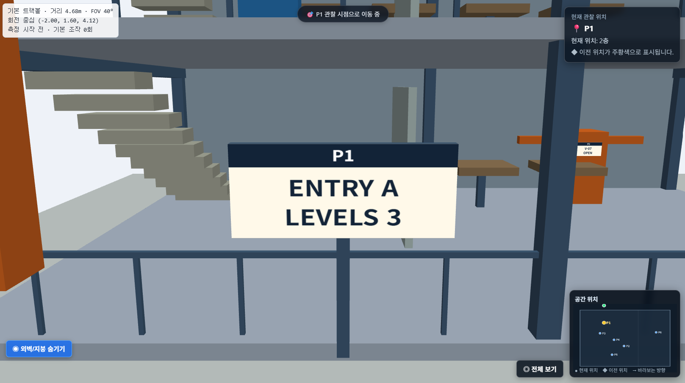

## 1. GitHub Pages 실행 주소 및 조작법

### 1-1. 기본 버전 (Baseline)

- 실행 주소: [https://your-github-id.github.io/repository-name/week4/baseline/](https://your-github-id.github.io/repository-name/week4/baseline/)
- 조작법:

    - 마우스 좌클릭 + 드래그: 모델 중심 회전 (trackball rotate)
    - 마우스 우클릭 + 드래그: 화면 평면 이동 (pan)
    - 마우스 휠 스크롤: 줌 인 / 줌 아웃 (zoom in / out)
    - 화면의 Preset 버튼 클릭: 지정된 관찰 위치로 순간 이동

### 1-2. 개선 버전 (Improved)

- 실행 주소: [https://your-github-id.github.io/repository-name/week4/improved/](https://your-github-id.github.io/repository-name/week4/improved/)
- 조작법:

    - 기존 트랙볼 조작 유지: 마우스 좌클릭, 우클릭, 휠로 자유롭게 탐색할 수 있습니다.
    - 관찰 지점 프리셋 버튼 (`P1` ~ `P6`, `O1` ~ `O2`, 전체 보기): 화면 상단이나 측면 패널의 버튼을 누르면, 시야가 가려지지 않는 시점과 거리로 카메라가 부드럽게 이동(smooth transition)합니다.
    - 투영 방식 전환 토글 (Perspective ↔ Orthographic): 버튼 한 번으로 원근 투영과 직교 투영을 바꿔서, 정면과 측면 정렬 비교를 쉽게 합니다.
    - 카메라 속도/감도 조절기 또는 Reset 버튼: 줌 감도를 보정하고, 길을 잃었을 때 한 번에 처음 전체 보기 상태로 돌아옵니다.


## 2. 기존 트랙볼 조작 방식 관찰 시간 및 불편점 분석

### 2-1. 관찰 지점별 탐색 시간 측정 결과

[기본 트랙볼 뷰어](https://cg.catholic.ac.kr/~mgchoi/CG/demos/d04-inspection.html)에서 지정된 8개 관찰 지점을 마우스 트랙볼 조작만으로 찾아가며 소요 시간을 측정했습니다.

| 관찰 지점 | 확인할 정보와 위치 | 소요 시간 |
| --- | --- | --- |
| `P1` | 본관 입구 안내 (동 이름, 층수) | 6초 |
| `P2` | 1층 안쪽 밸브 (식별 번호, 상태) | 19초 |
| `P3` | 2층 제어함 (작은 명판의 회로 번호) | 18초 |
| `P4` | 옥상 서비스 장치 (장치 이름, 점검 주기) | 12초 |
| `P5` | 별관 펌프 (제한 온도) | 18초 |
| `P6` | 전면 패널 정렬 (상단 높이, 폭 비교) | 25초 |
| `O1` | 전면 패널 정렬 (직교 뷰 비교) | 18초 |
| `O2` | 측면 돌출 비교 (전면 끝 돌출 비교) | 20초 |
| 전체 | 8개 지점 총 탐색 시간 | **136초 (약 2분 16초)** |

### 2-2. 상세 불편 사항 및 원인 분석

1. **줌(Zoom) 반응이 느리고 거리가 답답하게 줄어듦 (`P2` 등)**

    - **상태**: 마우스 휠을 많이 돌려도 조작 감도가 작아서, 모델과의 거리가 아주 조금씩만 가까워집니다.
    - **문제점**: 1층 안쪽 밸브처럼 건물 깊숙이 있는 세부 부품을 볼 때 답답하고 시간이 지연됩니다.

2. **회전 축이 부자연스럽고 의도치 않게 대각선으로 움직임 (`P6`)**

    - **상태**: 수평이나 수직으로 회전하려 해도 마우스 궤적에 따라 화면이 삐딱하게 돌거나 대각선으로 틀어집니다.
    - **문제점**: 시점을 일직선으로 맞추기 어렵고 카메라 축이 비틀어져서, 정밀한 뷰 위치를 잡는 데 25초로 가장 오래 걸렸습니다.

    

3. **벽, 난간, 구조물에 의한 시야 가림(`P2`)**

    - **상태**: 건물 내부 부품이나 2층, 옥상 장치를 보려 할 때 앞쪽의 외벽, 난간, 다른 층 구조물이 시야를 막습니다.
    - **문제점**: 장애물을 피해 카메라를 안쪽으로 밀어 넣으려고 불필요하게 복잡한 회전과 이동을 반복해야 합니다.

    

4. **공간적 맥락(spatial context) 상실**

    - **상태**: 작은 글씨나 명판을 읽으려고 극단적으로 줌인하면 화면 전체가 그 명판으로 가득 찹니다.
    - **문제점**: 정보를 확인한 직후 내가 건물의 어느 층, 어느 구역에 있는지 알 수 없게 되어, 전체 보기와 줌인을 번갈아 반복해야 합니다.

    

## 3. 사용자·관찰 목표 및 대안 비교·최종 설계

### 3-1. 사용자 및 관찰 목표

* **타겟 사용자**: 시설을 처음 접하는 검수자가 복합 연구시설 안의 주요 점검 부품(밸브, 제어함, 펌프 등)의 위치와 명판 정보를 빠르고 정확하게 확인해야 하는 상황

* **기존 문제**: 기본 트랙볼 조작에서는 줌 반응이 느리고, 회전 축이 비틀리거나 대각선으로 움직이며, 벽·난간·구조물에 의해 내부 장치가 가려지는 문제가 있었습니다. 또한 작은 명판을 읽기 위해 극단적으로 확대하면 건물 전체에서 현재 위치를 파악하기 어려워지는 문제가 발생했습니다.

* **관찰 목표**: 트랙볼을 반복적으로 조작하지 않아도 여섯 지점의 장치를 글자를 읽을 수 있는 거리와 방향에서 정확하게 관찰하고, 벽·난간 등으로 가려진 내부 장치에도 빠르게 접근할 수 있도록 하는 것. 동시에 관찰 중에도 해당 장치가 건물의 어느 위치에 있는지 파악할 수 있도록 공간적 맥락을 유지하는 것을 목표로 합니다.

### 3-2. 대안 스케치 및 장단점 비교 (기본 조작의 불편점 기준)

| 구분     | 대안 A — 고정 UI 패널                                     | 대안 B — 3D 오브젝트 직접 클릭 + 점검 목록                                                     |
| ------ | --------------------------------------------------- | -------------------------------------------------------------------------------- |
| 개념     | 화면 가장자리에 P1~P6, O1~O2 등의 관찰 위치 버튼과 카메라 이동 기능을 고정 배치 | 3D 화면에서 장치를 직접 클릭하거나 점검 목록에서 대상을 선택하면 해당 장치를 중심으로 적절한 관찰 시점으로 자동 이동              |
| 장점     | 버튼을 한 번 누르면 정해진 관찰 지점으로 이동할 수 있어 트랙볼 조작을 크게 줄일 수 있음 | 작은 장치를 직접 찾거나 목록에서 선택하면 해당 장치를 화면 중심과 회전 중심으로 설정하여 글자를 읽기 좋은 거리·방향으로 바로 접근할 수 있음 |
| 단점     | 버튼과 패널이 화면을 계속 차지하여 3D 모델을 관찰할 수 있는 공간이 줄어듦         | 작은 대상은 직접 클릭하기 어려울 수 있으므로 점검 목록 등의 보조 선택 방법이 필요함                                 |
| 공간적 맥락 | 개별 관찰 지점으로 이동한 뒤에는 전체 건물에서 현재 위치를 파악하기 어려울 수 있음     | 대상에 집중하면서도 현재 위치와 주변 구조를 함께 확인할 수 있도록 설계해야 함                                     |
| 장애물 대응 | 정해진 시점으로 이동하더라도 벽이나 층에 의해 대상이 가려질 가능성이 있음           | 관찰 대상에 접근할 때 필요한 일부 층·벽을 숨기거나 투명하게 처리하여 내부 장치를 직접 확인할 수 있음                       |

### 3-3. 최종 선택 및 개선안: "3D 오브젝트 직접 클릭 + 점검 목록 클릭 시 적절한 관찰시점으로 이동"

### **선택한 이유**

화면 측면에 고정 UI 패널을 크게 띄우면 3D 모델을 관찰할 수 있는 공간을 계속 차지하고, 다른 UI와 함께 사용할 경우 화면이 복잡해지는 문제가 있습니다. 따라서 별도의 큰 패널을 중심으로 조작하기보다 **3D 오브젝트 직접 클릭과 점검 목록 선택을 결합하는 방식**을 선택했습니다.

* 3D 화면에서 장치를 직접 클릭하면 선택한 부품을 **화면 중심과 회전 중심**으로 설정하고, 해당 장치의 명판과 형태를 확인하기 적절한 거리와 방향으로 카메라가 이동합니다.
* 화면에서 직접 클릭하기 어려운 작은 장치는 **점검 목록에서 해당 장치를 선택**하여 동일한 방식으로 관찰할 수 있도록 합니다.
* 여섯 지점(P1~P6)의 장치는 각각 글자를 읽을 수 있는 거리와 방향에서 관찰할 수 있도록 사전에 적절한 관찰 시점을 설정합니다.
* O1은 **전면 직교 뷰**, O2는 **오른쪽 측면 직교 뷰**에서 관찰할 수 있도록 하여, 두 대상을 같은 배율과 왜곡 없는 조건에서 비교할 수 있도록 합니다.
* 가로·세로 화면에서도 3D 모델의 비율이나 관찰 대상이 찌그러지지 않도록 화면 비율에 맞게 카메라와 뷰포트를 조정합니다.

### **장애물에 대한 개선**

기존에는 벽, 난간, 다른 층의 구조물에 의해 장치가 가려질 경우 사용자가 트랙볼을 반복적으로 조작하여 장애물을 피해 들어가야 했습니다.

이를 개선하기 위해 관찰 대상에 접근할 때 필요한 경우 **일부 층이나 벽을 숨기거나 투명하게 처리**할 수 있도록 합니다.

* 관찰을 위해 숨겨진 층·벽은 사용자가 현재 어떤 부분을 숨겼는지 확인할 수 있도록 별도로 표시합니다.
* 숨긴 부분을 다시 표시할 수 있는 **복원 방법**을 제공합니다.
* 장애물을 제거하더라도 밸브, 제어함, 펌프 등의 **모델 위치와 크기는 변경하지 않습니다.**
* 명판의 위치와 크기, 실제 명판에 표시된 **내용 역시 그대로 보존**하여 관찰 대상의 실제 정보를 유지합니다.

### **줄인 조작 (What operation is reduced?)**

* **불필요한 드래그와 휠 조작 감소**: 줌 감도가 낮아 같은 위치에 접근하기 위해 휠을 수십 번 돌리거나, 트랙볼 회전으로 카메라 축이 비틀리는 조작을 줄였습니다.
* **장애물 회피 조작 단축**: 벽이나 난간을 피해 카메라를 복잡하게 이동하는 대신, 대상을 선택하면 적절한 관찰 시점으로 바로 이동하도록 했습니다.
* **작은 대상 선택 조작 감소**: 화면에서 직접 클릭하기 어려운 작은 장치는 점검 목록에서 선택할 수 있도록 하여, 카메라를 반복적으로 움직여 대상을 찾아야 하는 과정을 줄였습니다.
* **비교를 위한 뷰 조작 감소**: O1과 O2를 각각 전면·오른쪽 측면 직교 뷰로 제공하여 사용자가 직접 회전과 확대를 반복하지 않아도 같은 배율 조건에서 대상을 비교할 수 있도록 했습니다.

### **유지한 정보 (What information is maintained?)**

* **정밀 시각 정보 (detail view)**: 선택한 장치를 화면 중심에 배치하고 글자를 읽을 수 있는 거리와 방향을 유지하여 명판과 부품의 세부 정보를 확인할 수 있습니다.
* **공간적 맥락 (spatial context)**: 장치를 확대해서 관찰하더라도 주변 구조와 현재 위치를 함께 확인할 수 있도록 하여, 관찰 후 건물 전체에서 현재 위치를 다시 찾는 과정을 줄였습니다.
* **모델 정보 보존**: 관찰을 위해 일부 층이나 벽을 숨기더라도 모델의 실제 위치와 크기는 변경하지 않습니다.
* **명판 정보 보존**: 명판의 위치·크기와 실제 표기 내용을 그대로 유지하여 단순히 정보를 목록으로 보여주는 방식으로 관찰을 대체하지 않습니다.
* **숨김 상태 정보**: 현재 숨겨진 층이나 벽이 무엇인지 사용자가 확인할 수 있도록 표시하고, 필요할 때 원래 상태로 복원할 수 있도록 합니다.

### **구현 요구사항**

* **P1~P6 여섯 지점 모두** 글자를 읽을 수 있는 거리와 방향에서 관찰할 수 있어야 합니다.
* 각 관찰 시점에서 **어느 장치의 정보인지 명확하게 확인**할 수 있어야 합니다.
* 가로·세로 화면 모두에서 3D 모델과 관찰 대상의 **비율이 찌그러지지 않아야 합니다.**
* 관찰을 위해 필요한 경우 **일부 층·벽을 숨기거나 투명하게 처리**할 수 있어야 합니다.
* 현재 숨겨진 부분을 사용자가 확인할 수 있도록 **숨김 상태를 표시**해야 합니다.
* 숨긴 층·벽을 원래 상태로 되돌릴 수 있는 **복원 기능**을 제공해야 합니다.
* 모델의 **위치·크기·명판 내용은 변경하지 않고 보존**해야 합니다.
* 모든 표지를 크게 확대하거나 화면 목록에 답을 나열하는 방식으로 실제 3D 공간에서의 관찰을 대체하지 않아야 합니다.
* 즉, 최종 개선안은 **사용자가 실제 3D 모델 안에서 장치를 확인하고 명판을 읽는 과정은 유지하면서, 카메라 이동과 장애물 회피에 필요한 불필요한 조작만 줄이는 것**을 목표로 합니다.


## 4. 실제 구현한 카메라·투영·입력 방식의 설명과 대표 코드

### 4-1. 카메라 구조 개요

카메라는 **target(바라보는 점)** 과 **구면 좌표(azimuth, elevation, distance)** 로 상태를 저장하고, 매 프레임 eye를 계산합니다. 자유 조작, 팻말 접근, 직교 비교 뷰가 모두 같은 상태값을 공유합니다.

| 상태값 | 의미 |
|---|---|
| `target` | 카메라가 바라보는 점이자 자유 회전의 중심 |
| `azimuth` | 수평 회전각 |
| `elevation` | 수직 회전각 (±1.45 rad로 제한) |
| `distance` | target에서 eye까지의 거리 (원근 투영에서 사용) |
| `fov` | 수직 시야각 |
| `near` | 가까운 클리핑 평면 |
| `orthographic`, `halfHeight` | 직교 투영 여부, 화면에 보이는 세로 절반 길이 |

### 4-2. eye · target · up 결정 방식

```js
// d04-inspection-controls.js
function orbit(){
  const cp = Math.cos(state.elevation);
  return [state.distance*cp*Math.sin(state.azimuth),
          state.distance*Math.sin(state.elevation),
          state.distance*cp*Math.cos(state.azimuth)];
}
eye = target + orbit();
up  = [0, 1, 0];
```

- **up은 항상 `(0,1,0)`으로 고정**합니다. roll이 없어 수평선이 기울지 않고, 좌우·상하 드래그가 대각선으로 꼬이지 않습니다. elevation을 ±1.45 rad로 제한해 시선이 up과 평행해지는 특이점도 피합니다.
- **팻말 접근 (P1~P6):** target은 팻말의 위치입니다. eye는 팻말의 **앞면 법선 방향**에 놓습니다.
  - 법선: `[sin(yaw), 0.2, cos(yaw)]`. y 성분 0.2로 약 11° 위에서 내려다보게 해 글자가 읽히면서 입체감도 남깁니다.
  - P5는 `yaw = π`이므로 건물 **뒤쪽**에서 보게 됩니다.
- **직교 비교 (O1, O2):** target은 비교 대상 두 개의 중점입니다. eye는 관찰 축 위에서 target으로부터 약 12 m 떨어진 곳에 놓습니다.

| 과제 | eye | target | 시선 방향 |
|---|---|---|---|
| O1 | (-5.3, 2.6, 18) | (-5.3, 2.6, 6) | −z (전면) |
| O2 | (23, 4.75, -0.3) | (10.8, 4.75, -0.3) | −x (우측면, 화면 왼쪽이 건물 앞쪽 +z) |

### 4-3. 대상 크기와 FOV에 따른 관찰 거리

```js
// d04-inspection-student.js
const fovRad   = fovDeg * Math.PI / 180;
const distance = Math.max(radius / Math.sin(fovRad / 2), 0.8);
```

대상을 반지름 R의 구로 보고, 그 구가 수직 FOV 안에 꼭 들어오는 거리 `d = R / sin(FOV/2)` 를 사용합니다.

- R = 팻말 긴 변 × 0.8 (정사각형 팻말의 반대각선이 변의 약 0.707배이므로, 모서리까지 구 안에 들어오는 값)
- 접근 시 FOV = 40°
- 최소 거리 0.8 m (아주 작은 명판에서 카메라가 과하게 붙는 것을 방지)

| 팻말 | 크기 (m) | R (m) | 계산 거리 (m) | 실제 거리 (m) |
|---|---|---|---|---|
| P1 | 2.00 × 0.85 | 1.60 | 4.68 | 4.68 |
| P2 | 0.55 × 0.28 | 0.44 | 1.29 | 1.29 |
| P3 | 0.28 × 0.16 | 0.22 | 0.66 | **0.80** (최소 거리 적용) |
| P4 | 0.90 × 0.40 | 0.72 | 2.11 | 2.11 |
| P5 | 0.65 × 0.35 | 0.52 | 1.52 | 1.52 |
| P6 | 0.42 × 0.22 | 0.34 | 0.98 | 0.98 |

### 4-4. 자유 회전의 중심

| 상황 | 회전 중심 | 이유 |
|---|---|---|
| 처음, "기본 카메라 위치로 복귀" | 전체 건물 근처 `(3, 3, 0)` | 전체 구조를 훑어보기에 적합 |
| 대상을 선택한 뒤 | **선택한 팻말 위치** | 좌우로 돌려도 팻말이 화면 중앙에 남아 확인하기 편함 |

- Shift+드래그 또는 우클릭 드래그로 중심을 옮길 수 있습니다.
- 이동량은 화면 픽셀이 월드 길이에 대응하도록 계산합니다. 원근은 `2·distance·tan(fov/2)`, 직교는 `2·halfHeight`를 화면 높이로 나눕니다.

### 4-5. 직교·원근 투영의 사용처와 이유

| 용도 | 투영 | 이유 |
|---|---|---|
| 기본 뷰, P1~P6 팻말 읽기 | **원근** | 자연스러운 깊이감과 주변 장비와의 공간 관계, 자유 회전과의 궁합 |
| O1 전면 패널 비교, O2 측면 돌출 비교 | **직교** | 높이·폭·돌출 정도를 깊이와 무관하게 같은 비율로 비교하기 위함 |

원근 투영에서는 가까운 물체가 더 크게 보입니다. O1의 패널 B(z = 6.8)는 패널 A(z = 5.2)보다 앞에 있어서 원근 뷰에서는 B가 더 커 보이지만, 직교 투영에서는 같은 크기가 같게 보여 화면에서 직접 비교할 수 있습니다. 두 과제는 `halfHeight = 3.4`(보이는 세로 범위 6.8 m)로 대상과 지지대를 모두 담습니다.

**직교 뷰의 확대·축소:** 직교에서는 거리를 바꿔도 화면 크기가 변하지 않으므로, 휠과 `+`/`-` 키가 `distance`가 아니라 `halfHeight`를 조절하도록 했습니다.

```js
// d04-inspection-controls.js
function zoom(f){
  if (state.orthographic) state.halfHeight = clamp(state.halfHeight*f, 0.3, 40);
  else                    state.distance   = clamp(state.distance*f, 0.18, 120);
}
canvas.addEventListener('wheel', e => {
  e.preventDefault();
  zoom(Math.exp(e.deltaY * .0035));
  state.actions++;
}, { passive: false });
```

### 4-6. 가림, near 클리핑, 카메라 이동 경로

#### 가림 처리

- `hidden` 집합에 `structure`(바닥·벽·기둥)와 `roof`(태양광 패널) 그룹을 넣어 건물 외피를 숨기는 **시스루** 방식을 사용합니다. 화면의 토글 버튼으로 직접 켜고 끌 수도 있습니다.
- 팻말은 팻말 ID만 `hidden`으로 검사하므로 **외벽을 숨겨도 항상 그려집니다.**
- 팻말 뒷판은 양면으로 그리고, 글자 면은 `CULL_FACE`를 켜서 뒤에서 볼 때 글자가 거울상으로 보이지 않게 했습니다.
- 클릭 판정도 같은 규칙을 따릅니다. 숨긴 부품은 무시하고, 난간·기둥처럼 가는 구조물은 클릭을 가리지 않게 건너뜁니다.

#### near 클리핑

- 접근 시 `near = 0.01`을 사용합니다. 최소 거리 0.8 m에서도 가까운 면이 잘리지 않고, 너무 작게 잡아 깊이 정밀도를 해치지도 않는 값입니다.
- 직교 뷰의 eye는 대상 바깥 약 12 m에 두어 앞에 가리는 구조물이 없게 했습니다.

#### 카메라 이동 경로

eye를 직선으로 옮기지 않고 target, distance, azimuth, elevation, fov를 같은 easing 값으로 각각 보간합니다. 대상을 계속 바라보며 호를 그리듯 접근하게 됩니다.

```js
// d04-inspection-student.js — easeInOutCubic, 800 ms
const easeInOutCubic = t =>
  t < 0.5 ? 4*t*t*t : 1 - Math.pow(-2*t + 2, 3) / 2;

// 방위각은 최단 방향으로 회전하도록 −π ~ π로 정규화
let diffAzi = dest.azimuth - startAzi;
while (diffAzi >  Math.PI) diffAzi -= Math.PI * 2;
while (diffAzi < -Math.PI) diffAzi += Math.PI * 2;

s.azimuth   = startAzi + diffAzi * ease;
s.elevation = startEle + (dest.elevation - startEle) * ease;
s.distance  = startDist + (dest.distance - startDist) * ease;
```

새 클릭이 들어오면 이전 애니메이션을 `cancelAnimationFrame`으로 취소하고 새 이동을 시작합니다.

### 4-7. 입력 방식

| 입력 | 동작 |
|---|---|
| 좌클릭 드래그 | 선택 중심 기준 회전 |
| 우클릭 드래그 / Shift + 드래그 | 중심 이동(pan) |
| 마우스 휠 | 확대·축소 (원근은 `distance`, 직교는 `halfHeight`) |
| 방향키, `+`, `-`, `Home` | 키보드 회전, 확대·축소, 기본 위치 복귀 |
| 3D 팻말·장비 클릭 | 해당 팻말 관찰 시점으로 자동 이동 |
| 오른쪽 점검 목록 클릭 | 같은 이동 로직 실행 |

- 드래그 이동 거리가 4 px보다 작으면 클릭, 크면 드래그로 판정해 회전 중에 접근이 발동하지 않게 했습니다.

#### 클릭 판정(피킹)

화면 좌표를 광선으로 바꾼 뒤 가장 가까운 대상을 고르고, 장비 부품은 `OWNER` 표로 팻말 ID에 연결합니다.

```js
// d04-inspection-viewer.js
function pointerRay(e){
  /* ... forward, right, up 계산 ... */
  if (c.orthographic){
    // 직교: 화면 평면 위의 점에서 시선과 평행하게 나가는 광선
    const origin = add(add(c.eye, scale(right,(2*u-1)*half*aspect)), scale(up,(1-2*v)*half));
    return { origin, direction: forward };
  }
  // 원근: eye에서 출발하는 광선
  return { origin: c.eye, direction: norm(add(add(forward,
           scale(right,(2*u-1)*tan*aspect)), scale(up,(1-2*v)*tan))) };
}

// 박스는 AABB(slab) 판정, 팻말은 사각형 면 판정
const OWNER = { 'valve-body':'P2', 'cabinet':'P3', 'roof-service':'P4',
                'rear-pipe':'P5',  'annex-pump':'P6', 'o1-a':'O1', 'o2-a':'O2' /* ... */ };
```

- 박스를 구(sphere)가 아닌 **정확한 AABB**로 판정해, 큰 바닥판·벽이 어디를 눌러도 먼저 잡히던 문제를 해결했습니다.
- 직교 뷰에서는 광선의 원점이 클릭 위치마다 달라지도록 처리했습니다.

### 4-8. 한계와 개선점

1. **외피 자동 숨김 조건이 거의 맞지 않습니다.** `moveTo`의 조건이 박스 ID, `'V'` 포함 여부, `y < 1.2`를 검사하는데, 클릭하면 `P2` 같은 팻말 ID가 넘어와서 조건이 대부분 성립하지 않습니다. 토글 버튼으로 직접 숨기는 방식은 정상 동작합니다. 자동 숨김을 의도대로 동작시키려면 아래처럼 바꿉니다.

```js
   // 기존
   if (id.includes('V') || (boxPart && boxPart.group === 'equipment') || pos[1] < 1.2) { ... }
   // 개선
   if (focusSign && focusSign.group === 'equipment') { ... }
```

2. **투영 전환이 보간되지 않습니다.** 원근과 직교는 값을 섞을 수 없어서, 이동을 시작하는 첫 프레임에 `orthographic`과 `halfHeight`가 바로 바뀝니다. 그래서 O1, O2로 이동하는 동안 화면이 갑자기 직교 투영으로 바뀌어 보입니다. 개선하려면 FOV를 아주 작게 줄이면서 distance를 늘리는 방식으로 원근을 직교에 근사시켜 전환할 수 있습니다.


## 5. 8건에 대한 개선 전후 비교

### 5-1. 개선 전후 측정 결과

P1~P6 점검 팻말과 O1~O2 직교 뷰를 대상으로 기본 버전과 개선 버전의 관찰 시간을 비교하였습니다.

관찰 시간은 **화면에서 대상을 확인하고, 필요한 글자를 읽어 실제 내용으로 옮겨 적기까지 걸린 시간**을 기록하였습니다.

조작 횟수는 기존 버전에서 제공되는 카운터를 기준으로 기록하였으며, 드래그·마우스 휠·키 입력·전체 보기 등의 조작을 포함합니다.

| 비교 항목 |   기본 버전   |  개선 버전  | 해석                                     |
| :---- | :-------: | :-----: | :------------------------------------- |
| P1 관찰 |  6초 / 17회 | 8초 / 2회 | 조작 횟수는 크게 감소했으며, 관찰 자체는 안정적으로 수행되었습니다. |
| P2 관찰 | 19초 / 58회 | 9초 / 1회 | 줌 조작이 크게 줄었고 관찰 시간이 감소하였습니다.           |
| P3 관찰 | 18초 / 39회 | 6초 / 1회 | 불필요한 이동과 확대 조작이 크게 감소하였습니다.            |
| P4 관찰 | 12초 / 23회 | 7초 / 1회 | 대상 접근이 쉬워져 조작 부담이 감소하였습니다.             |
| P5 관찰 | 18초 / 26회 | 9초 / 2회 | 확대 및 위치 조정에 필요한 조작이 감소하였습니다.           |
| P6 관찰 | 25초 / 24회 | 8초 / 1회 | 회전 문제를 개선하여 원하는 방향으로 관찰하기 쉬워졌습니다.      |
| O1 관찰 | 18초 / 26회 | 4초 / 1회 | 직교 뷰 확인에 필요한 조작이 크게 감소하였습니다.           |
| O2 관찰 | 20초 / 20회 | 6초 / 1회 | 불필요한 조작이 감소하여 빠르게 확인할 수 있었습니다.         |

### 5-2. 대표적인 불편 사항의 개선 결과

개선 전 관찰 과정에서 다음과 같은 불편 사항을 확인하였습니다.

| 불편 사항                 | 개선 전                                                        | 개선 후                                                   | 결과                |
| :-------------------- | :---------------------------------------------------------- | :----------------------------------------------------- | :---------------- |
| 줌 조작이 느림              | 마우스 휠을 여러 번 움직여야 원하는 거리까지 이동할 수 있었습니다.                      | 마우스 휠의 확대·축소 반응을 개선하여 적은 조작으로 원하는 거리까지 이동할 수 있게 하였습니다. | **해결**            |
| 회전 방향이 부자연스러움         | 원하는 방향으로 일직선으로 이동하지 않고 대각선으로 움직이는 경우가 있었습니다.                | 회전 조작을 개선하여 원하는 방향으로 관찰하기 쉬워졌습니다.                      | **해결**            |
| 벽·난간·다른 층에 가려짐        | 내부를 확인하려면 앞쪽 벽이나 난간, 다른 층의 구조물을 피하기 위해 추가적인 카메라 조작이 필요했습니다. | 외벽 숨기기 기능을 추가하여 내부를 가리는 구조물을 숨길 수 있도록 하였습니다.           | **해결**            |
| 전체 공간에서 현재 위치를 알기 어려움 | 작은 글자를 읽기 위해 가까이 이동하면 현재 위치가 전체 건물의 어디인지 알기 어려웠습니다.         | 카메라를 멀리 이동하여 전체 건물을 다시 확인해야 했습니다.                      | **부분 해결 → 추가 수정** |

### 5-3. 개선 후 관찰 결과

기본 버전과 비교했을 때 개선 버전에서는 대부분의 점검 대상에서 필요한 조작 횟수가 크게 감소하였습니다.

특히 P2의 경우 기본 버전에서는 **58회**의 조작이 필요했지만 개선 버전에서는 **1회**로 감소하였습니다. P3 역시 **39회 → 1회**, P4는 **23회 → 1회**, P6은 **24회 → 1회**로 감소하였습니다.

관찰 시간 역시 P2는 **19초 → 9초**, P3은 **18초 → 6초**, P6은 **25초 → 8초**로 감소하였습니다.

개선 전에는 마우스 휠을 반복해서 조작하거나 원하는 방향으로 회전하기 위해 추가적인 조작을 해야 하는 경우가 많았습니다. 개선 후에는 확대·축소와 회전이 보다 쉽게 이루어져 대상에 빠르게 접근할 수 있었습니다.

또한 내부 구조물을 확인할 때 외벽이나 난간 등에 가려지는 문제는 **외벽 숨기기 기능**을 통해 해결하였습니다.

다만 작은 글자를 확인한 이후 **현재 카메라 위치가 전체 건물에서 어디에 있는지 파악하기 어려운 문제는 남아 있었습니다.** 이 경우 다시 줌아웃하여 전체 건물을 확인해야 했기 때문에 추가적인 조작이 필요했습니다.

따라서 개선 전후 관찰을 통해 확인된 문제 중 하나가 완전히 해결되지 않았으며, 이를 추가 수정 대상으로 선정하였습니다.

### 5-4. 전면·측면 직교 뷰 비교

O1과 O2는 모델의 전면과 측면을 직교 방향에서 확인하는 작업으로 비교하였습니다.

#### O1 - 전면 직교 뷰





개선 전에는 원하는 직교 뷰를 확인하기 위해 여러 번의 조작이 필요했지만, 개선 후에는 적은 조작으로 전면 직교 뷰를 확인할 수 있었습니다.

#### O2 - 측면 직교 뷰





개선 후에는 측면 직교 뷰 역시 적은 조작으로 확인할 수 있었으며, 기본 버전에서 발생했던 불필요한 카메라 조작을 줄일 수 있었습니다.

---

## 5-5. 측정 한계

이번 측정은 동일한 사용자가 기본 버전과 개선 버전을 직접 사용하여 기록한 결과이므로, 측정 결과를 모든 사용자에게 동일하게 적용하기에는 한계가 있습니다.

첫째, **두 번째 시도에서 학습 효과가 발생할 수 있습니다.** 기본 버전을 먼저 사용하면서 대상의 위치와 관찰 방법을 익혔기 때문에 개선 버전에서는 이미 위치를 알고 있어 더 빠르게 수행했을 가능성이 있습니다.

둘째, **마우스 휠 조작 횟수는 사용하는 마우스와 환경에 따라 달라질 수 있습니다.** 따라서 조작 횟수의 절대적인 값만으로 사용 편의성이 개선되었다고 판단하기보다는, 동일한 기기와 동일한 조건에서 개선 전후의 변화를 비교하는 데 의미를 두었습니다.

셋째, 관찰 시간에는 **대상을 찾고, 글자를 확인하고, 확인한 내용을 직접 글로 옮겨 적는 시간**이 포함되어 있습니다. 따라서 순수하게 카메라 이동만을 측정한 값은 아닙니다.


---

## 5-6. 추가 수정 전후 기록

### 추가 수정 전

첫 번째 개선을 적용한 후 다시 P1~P6과 O1~O2를 관찰한 결과, 확대·축소와 회전 조작, 내부 구조물에 가려지는 문제는 개선되었습니다.

하지만 새로운 문제가 확인되었습니다.

> **작은 글자를 읽은 뒤 현재 카메라가 전체 건물의 어느 위치에 있는지 알기 어려웠습니다.**

팻말의 글자를 정확하게 읽기 위해 카메라를 가까이 이동하면 주변 건물이 화면에서 보이지 않기 때문에, 현재 위치를 확인하려면 다시 줌아웃하여 전체 건물을 확인해야 했습니다.

즉, 기존의 **세부 정보 확인 문제는 해결되었지만, 세부 정보를 확인하는 과정에서 전체 공간에 대한 위치 정보가 사라지는 문제**가 남아 있었습니다.




### 추가 수정 내용

이 문제를 해결하기 위해 기존의 가까운 관찰 거리를 줄이는 대신, **가까운 거리에서 세부 정보를 확인하면서도 전체 공간에서의 현재 위치를 확인할 수 있도록 미니맵 UI를 추가하였습니다.**

미니맵에는 다음 정보를 표시하도록 수정하였습니다.

* 전체 건물의 범위
* P1~P6 점검 위치
* 현재 카메라 위치
* 이전 카메라 위치
* 현재 카메라가 바라보는 방향
* 현재 선택한 점검 대상
* 전체 보기 기능

이를 통해 카메라를 다시 멀리 이동하지 않고도 현재 위치와 주변 공간의 관계를 확인할 수 있도록 하였습니다.

### 추가 수정 후

추가 수정 후에는 점검 팻말에 가까이 이동하여 작은 글자를 확인하는 기존의 관찰 방식을 유지하면서, 화면의 미니맵을 통해 현재 위치가 전체 건물의 어느 부분인지 확인할 수 있도록 하였습니다.

따라서 기존의 **세부 정보 확인을 위한 가까운 관찰 거리**는 유지하고, 가까이 이동했을 때 발생했던 **공간적 위치 인식의 어려움**을 보완하는 방향으로 수정하였습니다.

| 항목               | 추가 수정 전           | 추가 수정 후           | 결과     |
| :--------------- | :---------------- | :---------------- | :----- |
| 작은 글자 확인         | 가까이 이동하여 확인 가능    | 가까이 이동하여 확인 가능    | 유지     |
| 전체 건물에서 현재 위치 확인 | 줌아웃해야 확인 가능       | 미니맵에서 현재 위치 확인 가능 | **개선** |
| 현재 바라보는 방향 확인    | 화면만 보고 판단         | 미니맵의 방향 표시로 확인    | **개선** |
| 이전 위치 확인         | 직접 이동하거나 기억해야 함   | 미니맵에 이전 위치 표시     | **개선** |
| 전체 공간과 현재 위치 관계  | 가까이 이동하면 파악하기 어려움 | 미니맵을 통해 동시에 확인    | **개선** |



### 추가 수정의 의의

이번 추가 수정에서는 단순히 카메라를 덜 확대하도록 변경하지 않았습니다. 가까운 거리에서 **팻말의 작은 글자를 읽어야 한다는 기존 요구사항을 유지하면서**, 별도의 미니맵을 통해 공간적 맥락을 보완하였습니다.

이를 통해 **세부 정보 확인과 전체 공간에서의 위치 확인을 동시에 할 수 있도록 개선하였습니다.**

---

## 5-7. AI 제안에 대한 채택 및 수정

AI에게 개선 방향을 검토받은 결과, 카메라를 가까이 이동했을 때 전체 공간에 대한 위치를 잃는 문제를 해결하기 위해 **미니맵을 추가하는 방법**을 제안받았습니다.

이 제안을 그대로 카메라 이동을 제한하거나 줌 거리를 줄이는 방식으로 적용하지 않고, 기존의 가까운 관찰 기능은 유지하면서 미니맵을 추가하는 방향으로 수정하여 적용하였습니다.

그 이유는 팻말의 작은 글자를 정확하게 읽기 위해서는 현재의 가까운 관찰 거리가 필요하기 때문입니다.

따라서 최종적으로는 다음과 같은 방향을 선택하였습니다.

> **가까이 보는 기능은 유지하고, 미니맵을 추가하여 전체 공간에서의 위치 정보를 보완합니다.**

이렇게 기존 기능을 제거하는 대신 부족했던 정보를 보조 UI로 추가하는 방법을 선택하였습니다.

## 6. 중요한 Copilot 제안과 본인의 판단 및 검토한 대안

### 6-1. P4 옥상 서비스 위치의 명판 가림 문제

P4 옥상 서비스 위치로 이동하여 점검하려고 했을 때, **P4 장치의 팻말이 보이지 않는 문제**를 확인하였습니다.

처음에는 외벽이나 지붕을 가리는 기능을 해제하면 팻말이 다시 보이는 것을 확인하였습니다. 그러나 내부 구조물을 확인하기 위해 외벽이나 지붕을 숨긴 상태에서 팻말까지 함께 사라지는 것은 점검 목적에 적절하지 않다고 판단하였습니다.

따라서 본인은 다음과 같이 수정할 필요가 있다고 판단하였습니다.

> **외벽과 지붕은 숨길 수 있어야 하지만, 점검 대상인 팻말은 외벽/지붕 숨김 상태에서도 계속 보여야 합니다.**

이에 해당 문제의 원인을 확인하고 수정하도록 Copilot에 요청하였습니다.

### 6-2. Copilot의 제안 및 구현

Copilot은 문제의 원인을 확인한 결과, **P4 명판의 그룹이 `roof`로 설정되어 있어 외벽/지붕을 숨길 때 명판도 함께 숨겨지는 것**이라고 설명하였습니다.

Copilot의 수정 방향은 다음과 같습니다.

* `roof`와 `structure` 박스는 기존과 같이 숨길 수 있도록 유지합니다.
* 명판은 `roof` 또는 `structure` 그룹이 숨겨진 상태에서도 표시되도록 수정합니다.
* P4의 `FILTER / 30 DAYS` 명판을 외벽/지붕 숨김 해제 없이 확인할 수 있도록 수정합니다.

이 내용을 바탕으로 관련 코드를 Copilot을 통해 수정하였습니다.

### 6-3. 본인의 판단 및 검토

Copilot이 제안한 방법을 그대로 적용하기 전에, **외벽/지붕 숨김 기능 자체를 제거하는 방법**도 생각해 볼 수 있었습니다.

하지만 외벽과 지붕을 숨기는 기능은 건물 내부의 구조와 장치를 확인하기 위해 필요한 기능이므로, 이를 제거하면 기존에 해결한 **벽·난간·구조물에 가려지는 문제**가 다시 발생할 수 있다고 판단하였습니다.

또한 P4 팻말을 단순히 더 크게 만들거나 별도의 UI에 텍스트를 표시하는 방법도 있지만, 이는 실제 3D 공간에서 팻말을 확인한다는 점검 방식과 맞지 않는다고 판단하였습니다.

따라서 다음과 같이 판단하였습니다.

| 검토한 대안               | 판단     | 이유                                         |
| :------------------- | :----- | :----------------------------------------- |
| 외벽/지붕 숨김 기능 제거       | 거절     | 내부 구조물을 확인하기 어려워질 수 있습니다.                  |
| P4 팻말을 크게 표시         | 거절     | 실제 3D 공간에서 팻말을 확인하는 방식과 맞지 않습니다.           |
| 팻말을 별도 UI에 텍스트로 표시   | 거절     | 실제 장치에 붙어 있는 명판을 확인한다는 목적에서 벗어날 수 있습니다.    |
| 외벽/지붕은 숨기되 명판은 계속 표시 | **채택** | 기존 숨김 기능을 유지하면서 P4 점검에 필요한 명판도 확인할 수 있습니다. |

최종적으로 **외벽과 지붕의 숨김 기능은 유지하면서 점검용 명판은 숨겨지지 않도록 하는 방법을 선택하였습니다.**

수정 후에는 P4 옥상 서비스 위치로 이동한 상태에서 외벽/지붕 숨김 기능을 사용해도 `FILTER / 30 DAYS` 명판을 확인할 수 있게 되었습니다.